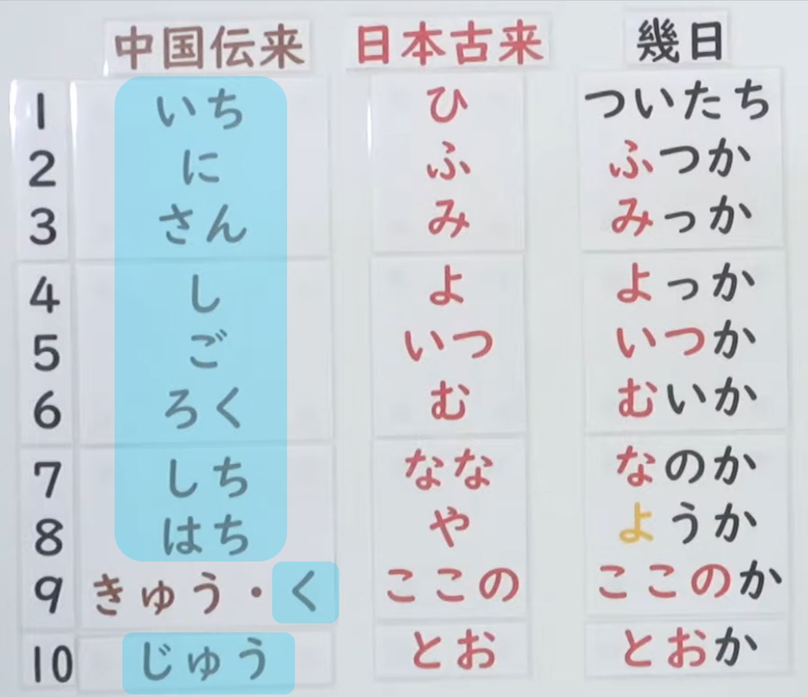
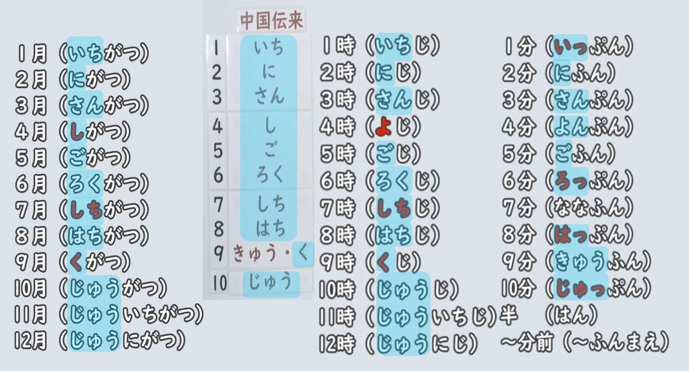
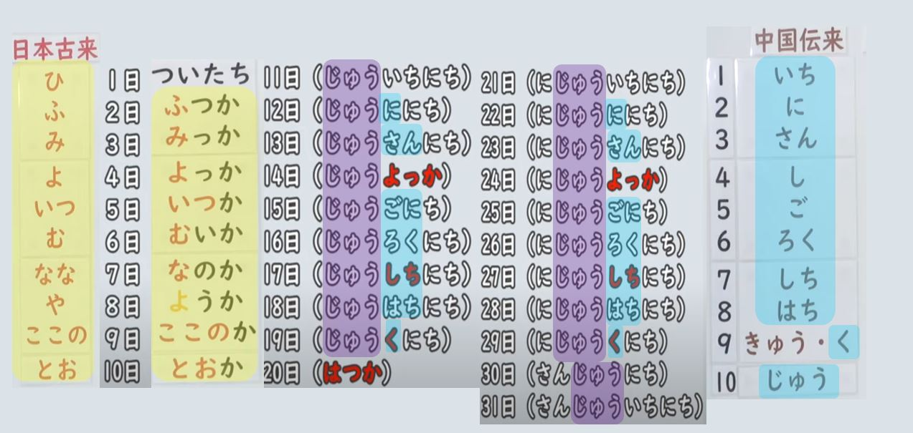
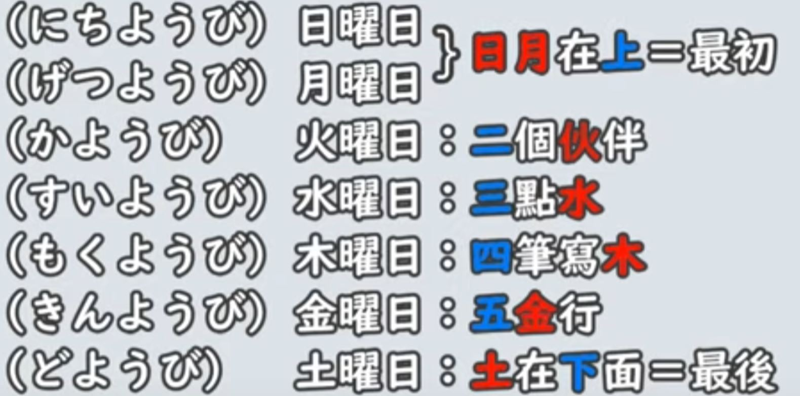

# [Ｎ５文法一覧](https://www.youtube.com/playlist?list=PLynCeSdpMqxD4OJHjNB3QkmfzfD7B_s67)

## [Ｎ５文法 - 動詞類](N5_grammar_verbs.md)
## [Ｎ５文法 - 助詞類](N5_grammar_particles.md)
## [Ｎ５文法 - 句型類](N5_grammar_sentence.md)

---

## [位置表現](https://youtu.be/VhGUps4dn3Y)

## [文体「丁寧体・普通体」](https://youtu.be/u5YluISdV9s)

## [二種類の丁寧形否定表現](https://youtu.be/SUGleiQ4Z8s)

## [名詞「普通形」](https://youtu.be/dlqTPC91x1E)

Notes

- 普通型是指在日文中，隨著對方身份的不同，說話的方式也會相應改變。
- 例如，當你第一次與陌生人或客戶交談，或在公司裡說話時，可能需要使用比較正式的說法，這就是丁寧型。
- 當你和家人或朋友交談時，就不需要那麼正式的說法，這就是普通型。
- 因此，初學者可能會經常聽到「です/じゃありません」這樣的說法。
- 然而，在連續的日文對話中，人們通常會使用比較隨意的說法，更像是和家人或朋友聊天，因此比較少用到「です/じゃありません」這樣的語言形式。
- 當然，在與日本人交流時，我建議你們首先學習丁寧型的說法。當你第一次與日本人見面時，應該使用丁寧型的說法。
- 當日本人告訴你們你們很熟悉了，不必那麼客氣時，你們就可以使用普通型的說法。

||丁寧|普通|
|--|--|--|
|現在肯定|学生`です`|学生`だ`|
|現在否定|学生`じゃありません`|学生`じゃない`|
|過去肯定|学生`でした|学生`だった`|
|過去否定|学生`じゃありませんでした`|学生`じゃなかった`|

- 其實，這個變化完全跟形容詞的普通型變化一樣，因此變化形式包括「だ」、「じゃない」、「だった」和「じゃなかった」。基本上，形容詞也是這樣變化的。
- 如果以單詞為單位來看，可以分為丁寧型和普通型。而句子使用丁寧型、普通型則稱為丁寧體或普通體。
- 使用丁寧型/體時，語氣比較正式。而當與家人朋友交談時，則不需要那麼正式，可以使用普通型/體。
- 以上是以名詞結尾的句子，從丁寧體到普通體的變化，整個會話的文體都變得比較坦白、比較客氣的說法。

||丁寧|普通|
|--|--|--|
|現在肯定|明日の天氣は雨てす。|明日の天氣は雨`だ`|
|現在否定|私は會社員じゃありません。|私は會社員`じゃない`|
|過去肯定|三年前、私はここの教師てした。|三年前、私はここの教師`だった`|
|過去否定|大昔、日本の首都は東京じゃありませんでした。|大昔、日本の首都は東京。`じゃなかった`|

除了以上提到的文型，還有很多普通型的用法。

- 疑問句: 如果使用普通體，就不需要使用「です」，也不需要用表示疑問的「か」。如果要在書信中表達，還需要加上一個問號。

||丁寧|普通|
|--|--|--|
|疑問句|今日は金曜日ですか。|今日は金曜日?|

- 「～とき」（～的時候）用於問什麼時候，前面可以是動詞、名詞，都可能接受普通型，例如「我以前是學生的時候，經常在這家店吃午餐」。
- 「～でしょう？」表示確認的語氣，例如「山田先生是單身吧？」這些文型中也會用到普通型。

[例文](https://youtu.be/dlqTPC91x1E?t=559)

### **父は高校の教師だ**

Eng: "My father is a high school teacher."

| Word | Romaji | Role | Meaning |
| --- | --- | --- | --- |
| 父 | chi-chi | Subject | father |
| は | wa | Particle | topic marker |
| 高校 | kou-kou | Adjective | high school |
| の | no | Particle | possession marker |
| 教師 | kyou-shi | Predicate | teacher |
| だ | da | Copula | the plain form of the copula "to be" |

### **彼女は独身じゃない。もう結婚している。**

Eng: "She is not single. She's already married."

| Word | Romaji | Role | Meaning |
| --- | --- | --- | --- |
| 彼女 | ka-no-jo | Subject | she, girlfriend |
| は | wa | Particle | topic marker |
| 独身 | do-kushin | Noun | single |
| じゃない | ja-nai | Negation | negative form of the copula だ (da) |
| もう | mo-u | Adverb | already |
| 結婚している | kek-kon-shi-te-i-ru | Predicate | present continuous form of the verb 結婚する (kekkon suru, "to marry") |

### **先週沖縄へ行った。しかし、滞在中ずっと雨だった。**

Eng: "I went to Okinawa last week. However, it rained throughout my stay."

| Word | Romaji | Role | Meaning |
| --- | --- | --- | --- |
| 先週 | sen-shuu | Noun | last week |
| 沖縄 | o-ki-na-wa | Noun | Okinawa |
| へ | e | Particle | marks direction to which action is done |
| 行った | i-ku-tta | Predicate | past tense of the verb 行く (i-ku, "to go") |
| しかし | shi-ka-shi | Conjunction | however |
| 滞在中 | tai-zai-chuu | Noun | stay / during the stay |
| ずっと | zu-tto | Adverb | continuously |
| 雨 | a-me | Noun | rain |
| だった | da-tta | Predicate | past tense of the copula だ (da) |

### **福袋の中身は私が欲しい物じゃなかった。**

Eng: "The contents of the lucky bag weren't what I wanted."

| Word | Romaji | Role | Meaning |
| --- | --- | --- | --- |
| 福袋 | fu-kubu-ku-ro | Subject | lucky bag |
| の | no | Particle | indicates possession or description |
| 中身 | na-ka-mi | Object | contents |
| は | wa | Particle | topic marker |
| 私 | wa-ta-shi | Subject | I, me |
| が | ga | Particle | marks the subject of the sentence |
| 欲しい | ho-shi-i | Adjective | wanted, desired |
| 物 | mo-no | Object | thing |
| じゃなかった | ja-na-ka-tta | Predicate | negative past tense of the copula verb だ (da) to indicate "was not" |

[会話](https://youtu.be/dlqTPC91x1E?t=589)

### **今度、出張でブラジルへ行くよ。**

Eng: "I'm going to Brazil on a business trip next time."

| Word | Romaji | Role | Meaning |
| --- | --- | --- | --- |
| 今度 | kon-do | Noun | next time |
| 、 | 、 | Particle | separates elements in the sentence |
| 出張 | shu-chou | Noun | business trip |
| で | de | Particle | indicates the means or location |
| ブラジル | bu-ra-ji-ru | Noun | Brazil |
| へ | e | Particle | indicates the destination of the action |
| 行く | i-ku | Verb | to go |
| よ | yo | Particle | indicates emphasis or assertion |

### **へえ。ブラジルの言葉はスペイン語？**

Eng: "Oh, is the language of Brazil Spanish?"

| Word | Romaji | Role | Meaning |
| --- | --- | --- | --- |
| へえ | he-e | Interjection | "Oh" or "I see" |
| 。 | 。 | Symbol | End of sentence |
| ブラジル | bu-ra-ji-ru | Subject | Brazil |
| の | no | Particle | Indicates possession or association |
| 言葉 | ko-to-ba | Subject | Language |
| は | wa | Particle | Marks the topic of the sentence |
| スペイン語 | su-pe-i-n-go | Object | Spanish language |
| ？ | ？ | Symbol | Question mark, indicates a question |

### **いや、スペイン語じゃない。ポルトガル語だよ。**

Eng: "No, it's not Spanish. It's Portuguese."

| Word | Romaji | Role | Meaning |
| --- | --- | --- | --- |
| いや | i-ya | Interjection | no |
| スペイン語 | su-pe-i-n-go | Noun | Spanish language |
| じゃない | ja-nai | Negative form of copula | isn't |
| ポルトガル語 | po-ru-to-ga-ru-go | Noun | Portuguese language |
| だ | da | Copula | is |
| よ | yo | Particle | emphasis, assertion |

### **そうか。出張、がんばってね。**

Eng: "Oh I see. Good luck on your business trip."

| Word | Romaji | Role | Meaning |
| --- | --- | --- | --- |
| そうか | sou ka | Interjection | "Oh I see" |
| 出張 | shu-chou | Noun | business trip |
| がんばって | gan-bat-te | Verb | do your best |
| ね | ne | Particle | sentence-ending particle for emphasis or seeking agreement |

## [普通形＋名詞（連体修飾）](https://youtu.be/fuNoYEBG-Bw)

## [名詞代替「の」](https://youtu.be/y5cmsp1XBks)

## [動詞・形容詞・名詞の並述](https://youtu.be/J80cLZHYUuc)

## [い形容詞「普通形」](https://youtu.be/rKQWoxJvzrE)

Notes

- 普通型就是比較坦白的說法的時候，就是用到普通型。 い行形容詞的丁寧型改變成普通型是非常簡單，就是不講“です”就好。
- 所謂比較坦白的時候，就像是跟朋友跟家人講話的時候。丁寧型的話很禮貌，但是有一點人跟人的心理上的距離比較有一點遠的感覺。那很親近的關係的話不用那麼客氣，用普通型來對話就好。
- 所以譬如說： 現在肯定丁寧型：「このラーメンは美味しい`です`」，這個拉麪很好吃，這個是比較有禮貌的說法。那朋友之間家人之間講話就是「このラーメンは美味しい」這樣子講就好。

||丁寧形|普通形|
|--|--|--|
|現在肯定|おいしい`です`|おいしい|
|現在否定|おいしくない`です`|おいしくない|
|過去肯定|おいしかった`です`|おいしかった|
|過去否定|おいしくなかった`です`|おいしくなかった|

普通型的用處不一定這些，還有有一些文型式就是用到普通型的，像：

**～とき　～的時候**

- 眠いとき、コーヒーを飲みます。想睡覺的時候喝咖啡，那這個「眠いです」會去掉「です」變成普通形的形式。

**～でしょう？　～對不對**

- 表示對方確認的時候，要跟對方確認一些內容的時候用這個「でしょう」對不對的時候。
- 北海道寒かったでしょう？北海道很冷對不對？有一個人去北海道玩，然後回來了，我問他北海道很冷對不對？那就是因爲已經去回來了，所以過去的事情我問「北海道寒かった」過去肯定型「でしょう」對不對，用的是普通型。

## [な形容詞「普通形」](https://youtu.be/ckd01Su3YNY)

Notes

||丁寧形|普通形|
|--|--|--|
|現在肯定|靜か`です`|靜か`だ`|
|現在否定|靜か`じゃありません`|靜か`じゃない`|
|過去肯定|靜か`でした`|靜か`だった`|
|過去否定|靜か`じゃありませんでした`|靜か`じゃなかった`|

- 像之前介紹的動詞和い形容詞一樣，普通型是一種坦白、親近的對話口氣，適用於與家人、朋友的會話中，無需客氣。
- 普通形的現在肯定形[だ]的部分並不一定出現，如在疑問句中，可以直接去掉だ，例如「今週の土曜日は暇ですか？」可以寫成「今週の土曜日は暇？」而不必加上だ。

- 除了與家人和朋友的對話之外，還有一些特定的文型需要使用普通形。例如

**～とき　～的時候**

- 「元気だった時、よく山に登りました」，表示「我健康的時候，常常去爬山」。

**～でしょう？　～對不對**

- 「中村さんは歌が`上手`でしょう？」表示「中村小姐很會唱歌對不對？」這時要使用「上手でしょう？」而不是加上だ。

## [形容詞の副詞用法](https://youtu.be/neY8weBna98)

## [形容詞の名詞接続](https://youtu.be/G-WeQQwGgyo)

Notes

日文的形容詞有兩種：一種是い形容詞，另一種是な形容詞。

い形容詞是以い結尾的形容詞，當修飾名詞時直接加在後面。

- 例如：高い山（高的山）。

而な形容詞的尾巴不固定，需要在後面加上な再接名詞。

- 例如：静かな町（安靜的小鎮）。

此外，在日語中，當名詞要修飾另一個名詞時，會使用の。但注意的是，の只用於名詞接名詞，而不用於形容詞接名詞的情況。

- 例如：日本語の本（日文的書）。

## [副詞](https://youtu.be/4uuRpPKbxYM)
## [感応詞](https://youtu.be/yTM-G1xa63Q)
## [指示詞](https://youtu.be/oLFV9NVepJs)
## [接続詞](https://youtu.be/bjcSp93qvhs)
## [接頭辞・接尾辞](https://youtu.be/qVEqeNEPpqA)
## [擬態語・擬声語（オノマトペ）](https://youtu.be/VvUwbqtzI0U)
## [疑問詞](https://youtu.be/Ff_Ca_WGZDA)
## [連体詞](https://youtu.be/Tg7rIpkBiPA)
## [連体修飾節内「が」⇔「の」交替](https://youtu.be/3hC8yIxB_aY)

## [数量詞](https://youtu.be/_CBGGYQ-M40)

## [数字](https://youtu.be/3fqzAjezi2k)

Notes

在日語中，每個數字有時候有多種發音，或是有促音變化等。

- 零的發音有兩種。一種是「ゼロ」，就是英文的「zero」，另一種是「れい」，就是中文的漢字「零」的發音。
  - 在較年長的人中，比較常用「れい」這種發音。
  - 但在深夜零點的時候，例如深夜0時15分，大部分人會念「れい」，很少人念「ゼロ」。
  - 但我覺得念「zero」的人越來越多，所以這邊寫兩種發音。
- 然後注意一下4「よん」的發音。如果有放數量詞，例如「四元」、「4年級」等，數量詞的開頭發音如果是「あ行」或「ね行」，4的發音就變成「よ」。所以這個是為了讓發音更加順口。
- 再來是0、4、7、9有「少數的發音」。這是指比較少用的發音。
  - 當把數字個別念，例如公車的號碼、房間號碼、或是像台灣的101大樓等，這時候遇到0479就會用少用發音。
- 例如，101大樓可以念成「いち `まる` いち ビル」，306房間可以念成「さん `まる`ろく」。其中的「まる」的意思是「圈圈/丸」，就是比較少用的0的說法。
- 然後，這個4的「し」的發音真的很少用。比較像快速念1234的「いち に さん し」，所以有人會念「し」，但其他的時候真的很少出現。例如四月的時候，「四月」這樣子念，其他時候真的很少出現這種發音。
- 七的少用用法「しち」也是很少用。主要用在「七月」、「十七號」、「七時」等部分。但7分鐘的話還是用「ななふん」，所以要注意。
- 九的少用用法「く」也是
- 日語中存在一種復古的發音，稱為中古音。中古音源自中文，而不同於現代日語中的一、二、三、四聲，它包含平聲、上聲、去聲和入聲，且有些音很短，類似於台語中促音的發音。

||常用發音|少用發音|復古發音|復古運用時機|回かい|冊さつ|點てん|杯はい|
|---|---|---|--|--|--|--|--|--|
|0|ゼロ れい | まる ||||
|1|いち|  |いっ|か　さ　た　は|いっかい|いっさつ|いってん|いっぱい|
|2|に|  |||
|3|さん|  |||
|4|よん（よ）|し  |||
|5|ご|  |||
|6|ろく|  |ろっ|か　＿　＿　は|ろっかい|`ろく`さつ|`ろく`てん|ろっぱい|
|7|なな|しち|||
|8|はち|  |はっ|か　さ　た　は|はっかい|はっさつ|はってん|はっぱい|
|9|きゅう| く|||
|10|じゅう|  |じゅっ（じっ）|か　さ　た　は|じゅっかい|じゅっさつ|じゅってん|じゅっぱい|

## [時間表現](https://youtu.be/QRyu_Yud0gs)

Notes

日語中文數字的發音，一般使用自古以來的日本念法或從中國轉來的數字念法。由於現代社會的共同使用，這兩種念法的部分會產生特別之處。

- [中文轉來的數字發音](https://youtu.be/QRyu_Yud0gs?t=156)，是「1: いち、2: に、3: さん、4: し、5: ご、6: ろく、7: しち、8: はち、9: きゅう or く、10: じゅう」。
- [日文傳統的數字發音](https://youtu.be/QRyu_Yud0gs?t=191)，是「1: ひ、2: ふ、3: み、4: よ、5: いつ、6: む、7: なな、8: や、9: ここの、10: とお」。

基本上跟隨中國傳來的數字發音的有...

- [月](https://youtu.be/QRyu_Yud0gs?t=30): 基本上跟隨中國傳來的數字發音
  - 特別注意: 4 (しがつ) [不念よ], 7（しちがつ）[不念なな], 9（くがつ）[不念きゅう]

- [小時](https://youtu.be/QRyu_Yud0gs?t=577)
- [分](https://youtu.be/QRyu_Yud0gs?t=662)
  - 同數字規則，後面是は行1 6 8 10會有促音變化

1-10 日比較接近古音

- [幾日](https://youtu.be/QRyu_Yud0gs?t=335)
- 大致上 1-10「日」的表現法跟日本古來音相同，但1號的發音卻與眾不同。
  - 這是因為源自日語的關係。月初的日語念法為「つきたち（月立）」，其中「たち」意為開始。
  - 例如「立冬」即指冬季的開始。
  - 而一個月的開始則被稱為「ついたち」，由「月立」轉化而來。
  - 因此，一號的發音不是從數字而來，而是源自「一個月的開始」的意思，讀作「ついたち」。
  - 2-10日大致上參照古音。 2: ふつか、3: みっか、4: よっか、5: いつか、6: むいか、7: なのか、8: ようか(8與古音比較不同)、9: ここのか、10: とおか。
- 11 之後回到中國傳來的數字規則

- [星期/曜日](https://youtu.be/QRyu_Yud0gs?t=470)

[例文](https://youtu.be/QRyu_Yud0gs?t=794)

### **今日は2020年3月13日、金曜日です。**

Eng: "Today is Friday, March 13, 2020."

| Word | Romaji | Role | Meaning |
| --- | --- | --- | --- |
| 今日 | kyoo | Subject | today |
| は | wa | Particle | marks the subject of the sentence |
| 2020年3月13日 | nii-sen-ni-jyuu-nen san-gatsu juu-san-nichi | Subject | March 13, 2020 |
| 、| 、| Particle | separates the date from the day of the week |
| 金曜日 | kin-yoo-bi | Predicate | Friday |
| です | desu | Copula | to be (polite) |

### **東京は夜の7時です。ニューヨークは今何時ですか。**

Eng: "It's 7 PM in Tokyo. What time is it now in New York?"

| Word | Romaji | Role | Meaning |
| --- | --- | --- | --- |
| 東京 | tou-kyou | Subject | Tokyo |
| は | wa | Particle | topic marker particle |
| 夜 | yoru | Noun | night |
| の | no | Particle | possessive particle |
| 7時 | shichi-ji | Noun | 7 o'clock |
| です | desu | Verb | to be |
| ニューヨーク | nyuu-yooku | Subject | New York |
| は | wa | Particle | topic marker particle |
| 今 | ima | Adverb | now |
| 何時 | nan-ji | Noun | what time |
| ですか | desu ka | Verb | to be (question form) |

### **私は毎朝8時に起きます。**

Eng: "I wake up at 8 o'clock every morning."

| Word | Romaji | Role | Meaning |
| --- | --- | --- | --- |
| 私 | wa-ta-shi | Subject | I |
| は | wa | Particle | topic particle |
| 毎朝 | mai-asa | Noun | every morning |
| 8時 | ha-ji | Noun | 8 o'clock |
| に | ni | Particle | marks the time when the action occurs |
| 起きます | o-ki-masu | Predicate | present tense of the verb 起きる (o-ki-ru, "to wake up") |

### **学校の授業は9時半から16時50分までです。**

Eng: "School classes are from 9:30 to 16:50."

| Word | Romaji | Role | Meaning |
| --- | --- | --- | --- |
| 学校 | ga-kou | Subject | school |
| の | no | Particle | indicates possession |
| 授業 | ju-gyou | Object | class/lesson |
| は | wa | Particle | marks the topic of the sentence |
| 9時半 | ku-ji-han | Object | 9:30 |
| から | kara | Particle | indicates starting point |
| 16時50分 | ju-roku-ji-go-juppun | Object | 16:50 |
| まで | ma-de | Particle | indicates end point |
| です | desu | Copula | to be verb indicating politeness |

[会話](https://youtu.be/QRyu_Yud0gs?t=828)

### **明日は何時に来ましょうか。**

Eng: "What time shall we come tomorrow?"

| Word | Romaji | Role | Meaning |
| --- | --- | --- | --- |
| 明日 | ashita | Noun | tomorrow |
| は | wa | Particle | topic marker |
| 何時 | nan-ji | Noun | what time |
| に | ni | Particle | indicates time |
| 来ましょうか | ki-ma-shou-ka | Predicate | polite expression for "shall we come" (stem of the verb 来る (ku-ru, "to come") + auxiliary verb ましょう (ma-shou) for suggestion or invitation + question particle か (ka)) |

### **発表会は10時ですから、発表会が始まる前に**

Eng: "The presentation is at 10 o'clock, so before the presentation starts"

| Word | Romaji | Role | Meaning |
| --- | --- | --- | --- |
| 発表会 | hap-pyou-kai | Subject | presentation, announcement meeting |
| は | wa | Particle | marks the topic of the sentence |
| 10時 | juu-ji | Noun | 10 o'clock |
| ですから | desu-kara | Conjunction | because, so |
| 発表会が始まる | hap-pyou-kai ga ha-ji-ma-ru | Predicate | the presentation starts |
| 前に | mae-ni | Adverb | before |

### **来てください。**

| Word | Romaji | Role | Meaning |
| --- | --- | --- | --- |
| 来て | ki-te | Predicate | the te-form of the verb 来る (ku-ru, "to come") |
| ください | ku-da-sai | Suffix | a request, similar to "please" in English |

### **わかりました。じゃ、10時10分前にここへ来ますね。**

Eng: "Understood. I'll come here by 10:10 then."

| Word | Romaji | Role | Meaning |
| --- | --- | --- | --- |
| わかりました | wa-ka-ri-ma-shi-ta | Predicate | past tense of the verb 分かる (wa-ka-ru, "to understand") |
| じゃ | ja | Particle | a contracted form of では (de-wa), meaning "then" or "in that case" |
| 10時10分前に | ju-u-ji-tou-juu-fun-mae-ni | Adverbial phrase | "before 10:10" |
| ここへ | ko-ko-e | Particle | "here" (to this place) |
| 来ます | ki-ma-su | Predicate | future tense of the verb 来る (ku-ru, "to come") |
| ね | ne | Particle | a sentence-ending particle used to seek agreement or confirmation |

### **はい。お願いします。**

Eng: "Yes. Please."

| Word | Romaji | Role | Meaning |
| --- | --- | --- | --- |
| はい | ha-i | Particle | an affirmative response, "yes" |
| お願いします | o-ne-gai-shi-masu | Predicate | a polite expression of request, "please" |

## [頻度・程度・量の表現](https://youtu.be/x32zi7cGVQg)
