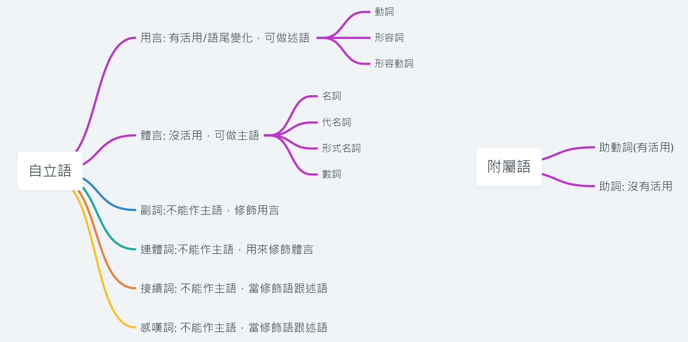

Overview

| 日語名稱 | 英文名稱 | 中文解釋 | 例子 | 例句 |
| --- | --- | --- | --- | --- |
| 名詞 | Noun | 名詞，用來表示人、事、物等名稱或代稱的詞語 | 人 (ひと), 本 (ほん), 犬 (いぬ) | 私は人が苦手です。 (わたしはひとがにがてです。) |
| 動詞 | Verb | 動詞，用來表示動作、狀態、存在等詞語 | 走る (あるく), 食べる (たべる), 見る (みる) | 私は毎日ジョギングを走る。(わたしはまいにちじょぎんぐをあるく。) |
| 形容詞 | Adjective | 形容詞，用來表示人、事、物等性質或狀態的詞語 | 大きい (おおきい), 美しい (うつくしい), 靜かな (しずかな) | この町はとても靜かなところです。(このまちはとてもしずかなところです。) |
| 間投詞 | Parenthesis | 插入語，用來插入句子中，起修辭作用等 | ちなみに (ちなみに), つまり (つまり), なんでか (なんでか) | 明日から海外旅行に行くつまり、今日は荷造りをします。(あしたからかいがいりょこうにいくつまり、きょうはにづくりをします。) |
| 代名詞 | Pronoun | 代名詞，用來代替名詞的詞語，包括人稱代名詞、指示代名詞、疑問代名詞等 | 私 (わたし), 彼 (かれ), 何 (なに) | 彼は學生ですか？ (かれはがくせいですか？) |
| 副詞 | Adverb | 副詞，用來修飾動詞、形容詞、其他副詞等的詞語 | すぐに (すぐに), ゆっくり (ゆっくり), 靜かに (しずかに) | 彼女はすぐに答えました。(かのじょはすぐにこたえました。) |
| 連體詞 | Adnominal adjective | 連體詞，用來修飾名詞的詞語 | この (この), あの (あの), どの (どの) | この本はとても面白いです。(このほんはとてもおもしろいです。) |
| 接續詞 | Conjunction | 連接詞，用來連接單詞、短語、從句等的詞語 | そして (そして), しかし (しかし), また (また) | 私は學生ですが、彼は教師です。(わたしはがくせいですが、かれはきょうしです。) |
| 感嘆詞 | Interjection | 感嘆詞，用來表示情緒、心情等的詞語 | あっ (あっ), わあ (わあ), やれやれ (やれやれ) | あっ、何ですかそれは！(あっ、なんですかそれは！) |
| 助動詞 | Auxiliary verb | 助動詞，用來表示語氣、時態、形態等，分爲五類：ます型、た型、て型、い型和不變型 | です (です), ます (ます), た (た) | 今日は晴れです。(きょうははれです。) |
| 助詞 | Particle | 助詞，用來表示語法關係、語氣等的詞語，包括主格助詞、目的格助詞、連用形助詞等 | は (は), を (を), に (に) | 私は映畫を見ました。(わたしはえいがをみました。) |

> 在日語中，自立語和附屬語的搭配方式非常靈活，不同的語法結構可以使用不同的自立語和附屬語來表達不同的含義。

## 「自立語」
- 指的是可以單獨存在且有獨立含義的詞語，包括名詞、動詞、形容詞、副詞、感嘆詞等。
- 這些詞語可以獨立作爲句子的一部分，不依賴其他詞語就能構成一個簡單的句子，
- 如「私は學生です」（我是學生）中的「私」、「學生」和「です」就是自立語。

## 「附屬語」
- 相反於自立語，指的是不能獨立使用，必須依附於其他詞語才能發揮作用的詞語。
- 附屬語可以分爲「標記」和「助詞」兩種類型。標記是用來標識某個句子成分的詞語，
- 如「は」、「が」、「の」等；而助詞則用於在一個句子中表示詞語的語態、時態、語氣等等語法信息，如「を」、「に」、「で」、「て」等。

## 「用言」

> 用言是句子的重要組成部分，可以表達句子的主要意義和信息。掌握不同用言的用法和變化規律，是學習日語語法的基礎。

- 指的是可以表示動作、狀態、性質等語意的詞語，主要包括「動詞」和「形容詞」。
- 它們在句子中可以作爲謂語，表示主語的動作、狀態、性質等等。
- 具體而言，「動詞」是表示動作或變化的詞語，可以分爲五段動詞和一段動詞兩種類型；
- 「形容詞」是表示事物性質或狀態的詞語，可以分爲イ形容詞和ナ形容詞兩種類型。
- 這些詞語都可以根據語態、時態、語氣等方面的不同來變化。

## 「體言」。

- 一種特殊的用言類型。所謂「體言」指的是一些表示存在、數量、分類等語意的詞語，主要包括「名詞」和「代詞」。
- 它們可以在句子中作爲主語、賓語、補語等，起到連接句子成分的作用。
- 與動詞、形容詞不同的是，體言本身並不表示動作或狀態，而是表示某種事物或概念的名稱或代稱。

