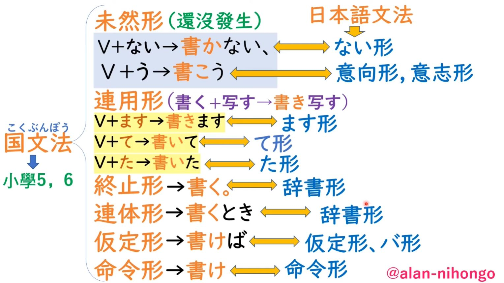
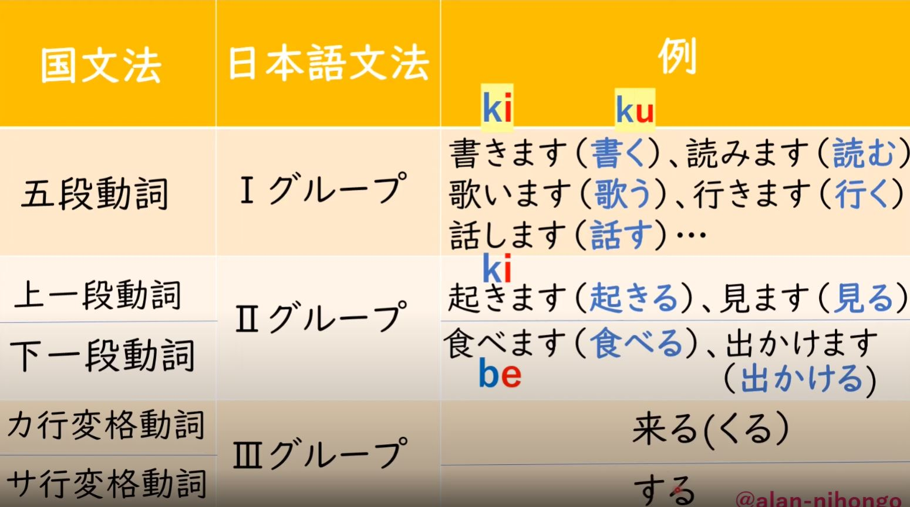
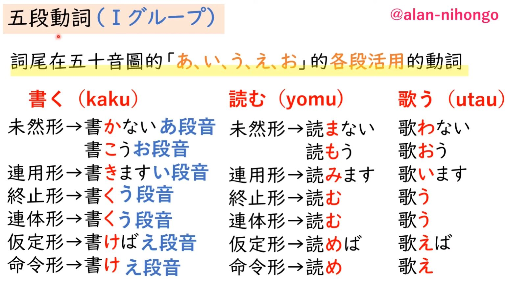
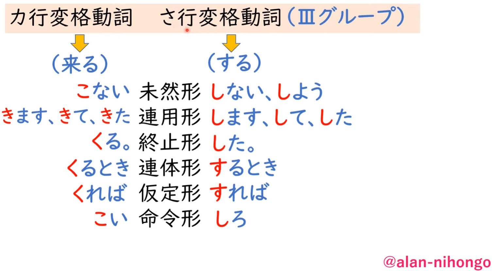

# Verb

## Overview

表示人、事、物的行為、動作或存在的詞

:yellow_square:**特點**

- 有活用 (詞尾變化)
- 可做述語

:yellow_square: **功用**

做述語

**ははかおとうとを`しかる`**

Eng: "Mother scolds (her) younger brother."

| Word | Romaji | Role | Meaning |
| --- | --- | --- | --- |
| はは | ha-ha | Subject | mother |
| かおとうと | ka-o-to-u-to | Object | younger brother |
| を | wo | Particle | marks the object of the sentence |
| しかる | shi-ka-ru | Predicate | present tense of the verb しかる (shi-ka-ru, "to scold") |

做修飾語

**わたしは`泣く`子がきらい**

Eng: "I dislike children who cry."

| Word | Romaji | Role | Meaning |
| --- | --- | --- | --- |
| わたし | wa-ta-shi | Subject | I |
| は | wa | Particle | marks the subject of the sentence |
| 泣く子 | na-ku-ko | Object | children who cry |
| が | ga | Particle | marks the object of the sentence |
| きらい | ki-ra-i | Predicate | negative adjective meaning "to dislike" |

作主語

**`負ける`が勝ち**

Eng: "Sometimes, to lose is to win."

| Word | Romaji | Role | Meaning |
| --- | --- | --- | --- |
| 負ける | ma-ke-ru | Predicate | present tense of the verb 負ける (ma-ke-ru, "to lose") |
| が | ga | Particle | indicates contrast |
| 勝ち | ka-chi | Predicate | noun meaning "victory" |

:yellow_square:**活用變化**

(日本人小學文法: 國文法 / 日本教外國人的文法: 日本與文法 有對應的關係 from [alan 日語video](https://youtu.be/bxOD6nLH8rY))

- **未然形**是五段動詞的一種活用形式，表示“未然”，即表示動作還沒有發生，或表示尚未確定的狀態。未然形可以用於各種文法結構中，例如用於否定、命令、條件等等。

- **連用形**是指動詞、形容詞、形容動詞等詞彙的一種變形形式，也叫做“連用形态”。 具體來說，連用形常常用來表示動作或狀態的連續或頻繁發生。此外，連用形也可以用來構成動詞的派生形式，例如連用形加上助詞“て”可以構成“て形”，表示動作的進行。

- **終止形**是動詞、形容詞、形容動詞等詞彙的一種變形形式，也稱為“終止态”。具體來說，終止形指的是動詞等詞彙在句子中作為謂語時的基本形式，表示動作或狀態的結束或定睛。在日語的句子中，通常最後一個詞是終止形。

- **連體形**指的是動詞、形容詞、形容動詞等詞彙的一種變形形式，也稱為“連体形”。 具體來說，連體形指的是動詞、形容詞、形容動詞等詞彙在句子中作為修飾語時的基本形式，用來修飾名詞或代詞。在日語的句子中，一般是用連體形來描述和說明名詞或代詞的性質、狀態或特徵。

- **假定形**是動詞、形容詞、形容動詞等詞彙的一種變形形式，也稱為“仮定形”。 具體來說，假定形指的是動詞、形容詞、形容動詞等詞彙在句子中作為假設、條件、推測等時的基本形式，表示假定的情況。在日語的句子中，假定形常常和助詞“ば”一起使用，表示假設條件。

- **命令形**指的是動詞、形容詞等詞彙在表達祈使、命令、勸誘等時的一種變形形式。在日語中，命令形常常用於表示直接命令或者委婉勸誘等情況。

:yellow_square:**種類(按照型態及變化規則)**

|||
|--|--|
|五段動詞||
|上一段動詞/下一段動詞||
|カ行/サ行變格動詞||

## 五段動詞

- a.k.a. 第一類動詞 **基本型** 的語尾都以u音結尾　如　う　く　す　つ　ぬ　ふ　む　ゆ　る

|形態|功用|中文|
|--|--|--|
|未然形 + ない|表示否定|不、沒有|
|未然形 + う|表示意志或推量|吧|
|未然形 + せる/ねる|表示被動、可能、自發、使役|能、讓、被|

|形態|功用|
|--|--|
|連用形 + 用言|構成連用法|
|連用形 + 、|表示句子暫時停頓|
|連用形 + 接續助詞/助動詞|-|

|形態|功用|
|--|--|
|終止形 + 。|表示句子結束|
|終止形 + 接續助詞 `*1`|構成接續式|
|終止形 + 傳聞/推量助動詞 `*2`|-|
|終止形 + 終助詞|-|

- `*1`: が、けど、から、と
- `*2`:　そうだ、だろう、らしい

|形態|功用|
|--|--|
|連體形 + 體言/形式名詞|作連體修飾語用|
|連體形 + 助詞(ので、のに、だけ、ほど..)|-|

|形態|功用|中文|
|--|--|--|
|假定形 + ば|表示假定|如果...就|

|形態|功用|
|--|--|
|命令形 + 。/ろ/よ|表示命令|