# [楊老師基礎基本語 左手五指學習法 五段活用](https://youtu.be/ra2r0rX4HkA)

日語動詞/形容詞的單字結構都是由

`語幹` `語尾` `助詞` 組成:

- 喝: `の` `み` `ます`
- 吃: `た`　`べ` `ます`

從一個動詞/形容詞的`ます`型來看他的語尾 依照語尾不同把動詞分兩類

- `のみます` -> 語尾み ->　`尾音i => 第１類`
- `たべます` -> 語尾べ ->　`尾音e => 第2類`

動詞/形容詞**共用**相同的5個助詞

- 助詞拿來表示時態或是語氣
- 注意 在日文 形容詞也有 時態語氣
- 同一個助詞用在動詞/形容詞的涵義相同

||形容詞|動詞|
|--|--|--|
|~ない|否定形。不~|表示否定。不~(=~ません)|
|~て|中止形*。~而又~|表示連貫。而~|
|~た|過去形|表示過去。~了(=~ました)|
|~ぼ|假設形。若~|表示假定。若~|
|~う|推測形。~吧|表示意志。推測。~吧(=~ましょう)|

*"中止" 是指"中"間停"止"(後面還有)的表示，是在表示連貫!

### 形容詞的五段活用

|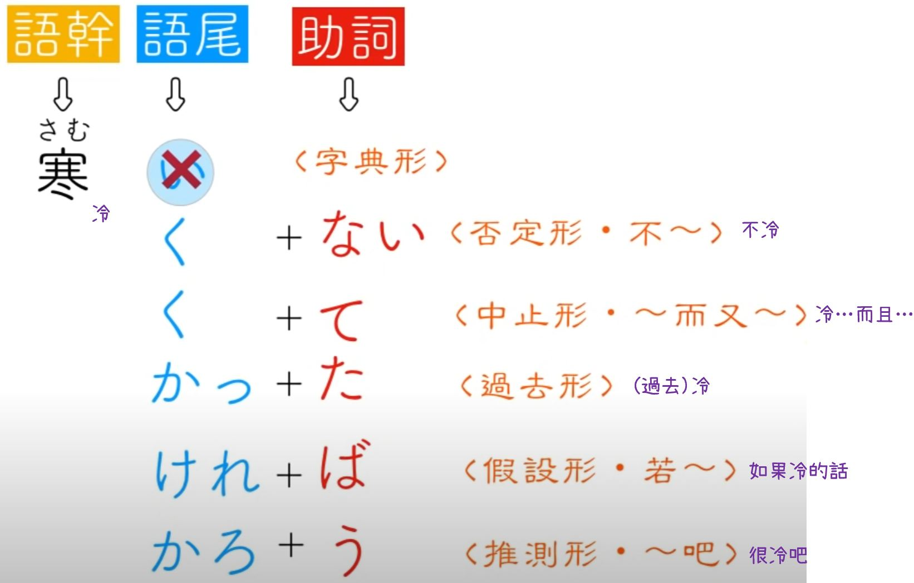|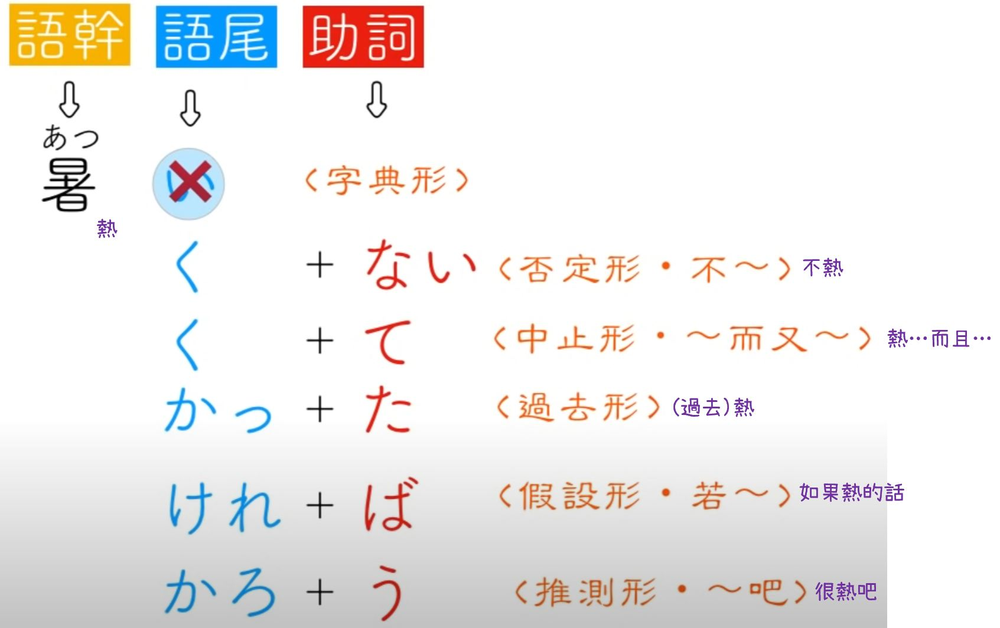|
|--|--|
|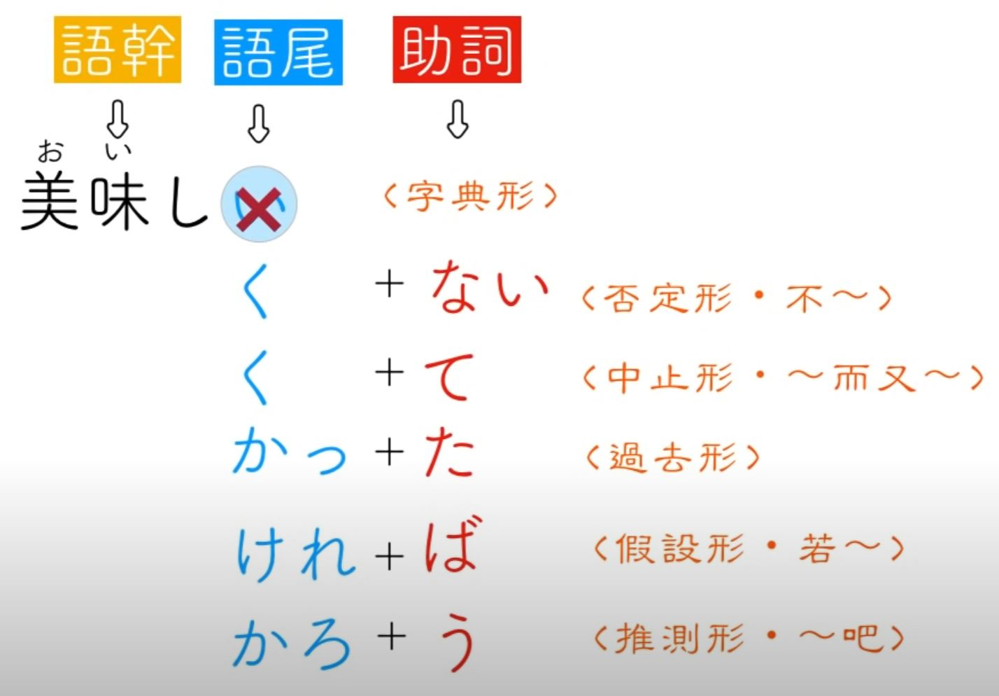||

### 第二類動詞(尾音e)的語尾不會隨著助詞改變而改變

|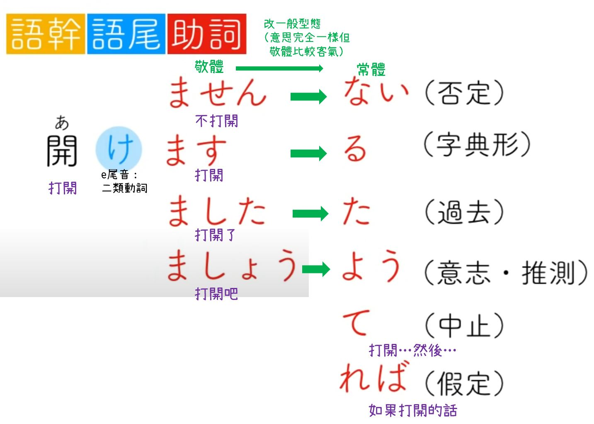|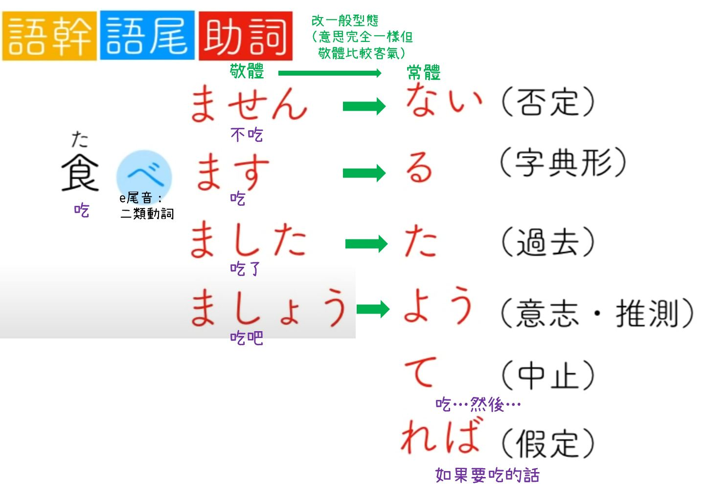|
|--|--|

### 第一類動詞(尾音i)的語尾會隨著助詞的改變而改變，又名**五段活用動詞**

哪五段？ あ　い　う　え　お　段，利用這五段來當作語尾來接各種的助詞

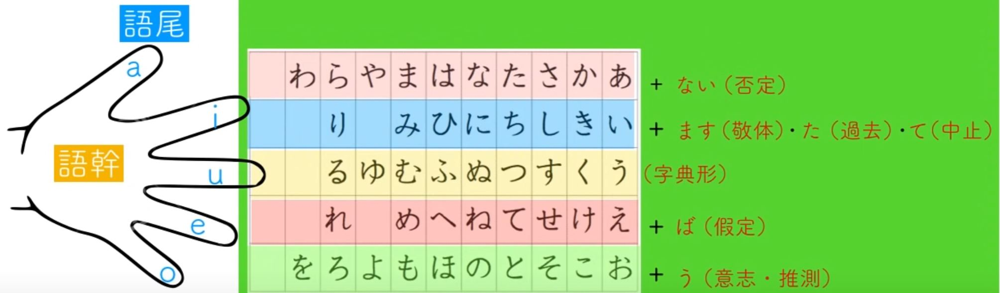

|語尾對應|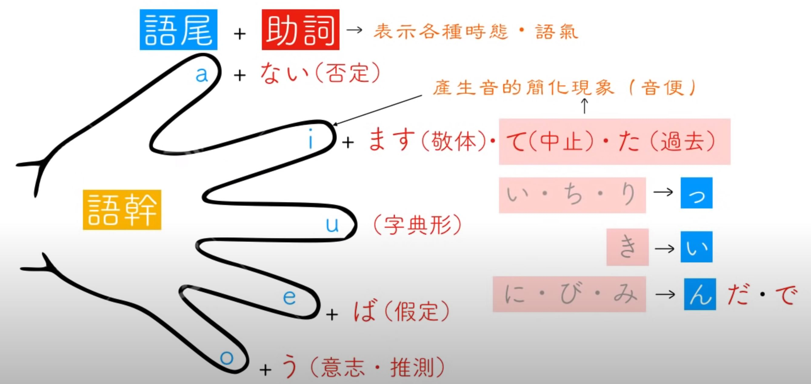|
|--|--|
|~~あ~~わ い う え お|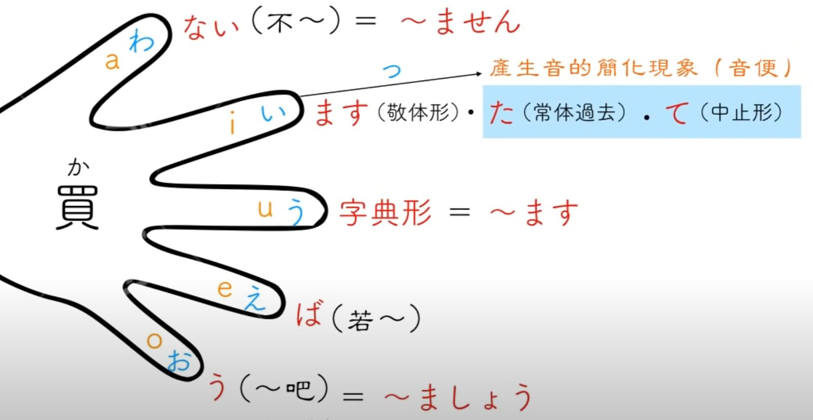|
| か き く け こ|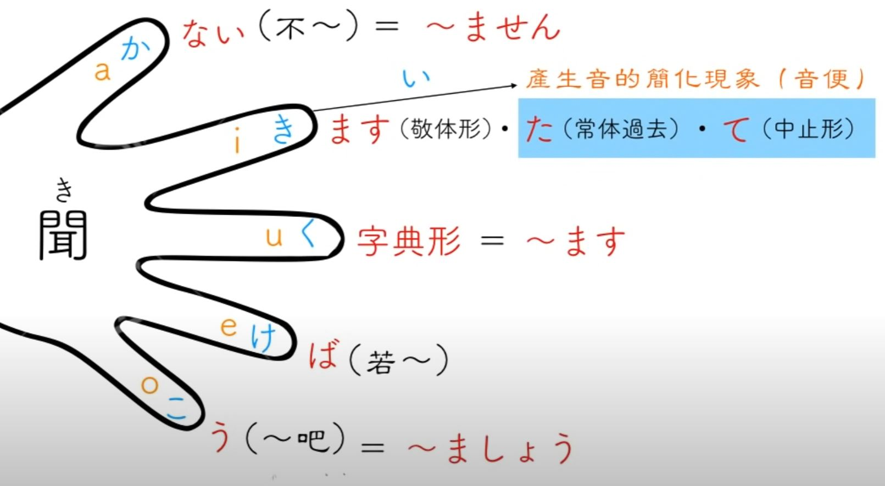|
| さ し す せ そ|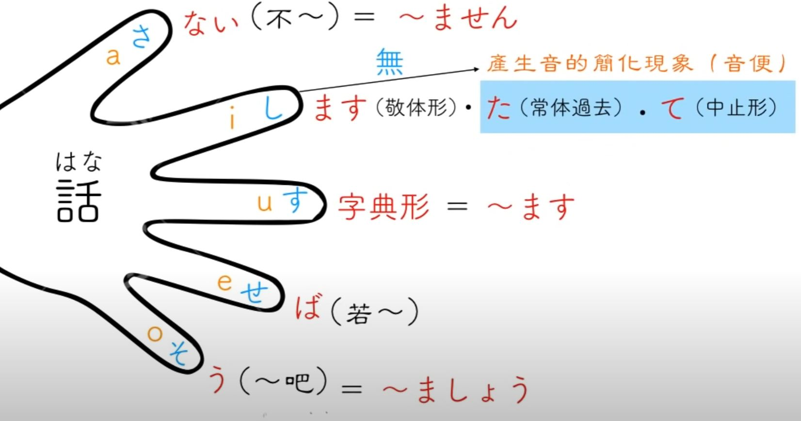|
| た ち つ て と|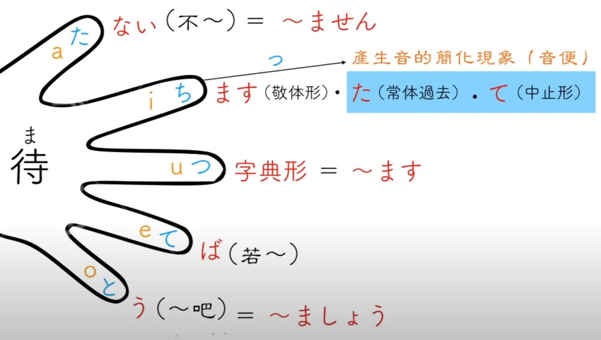|
| な に ぬ ね の|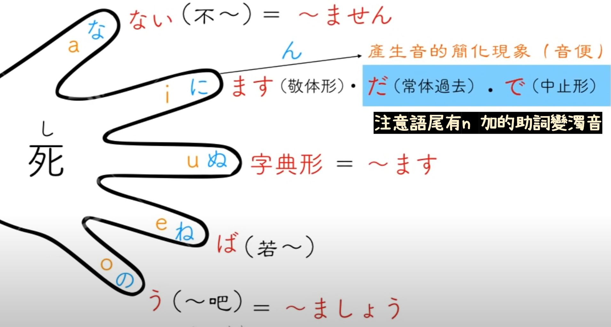|
| ば び ぶ べ ぼ|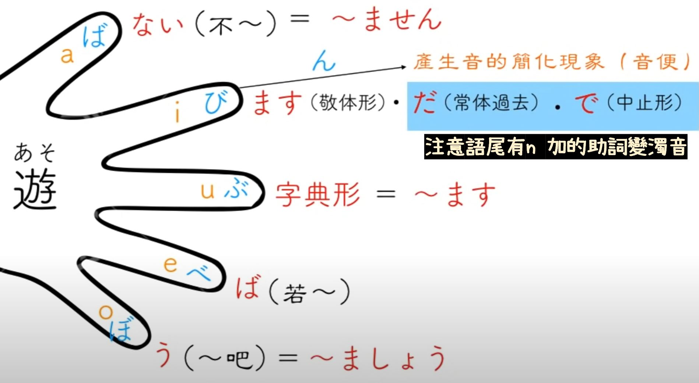|
| ま み む め も|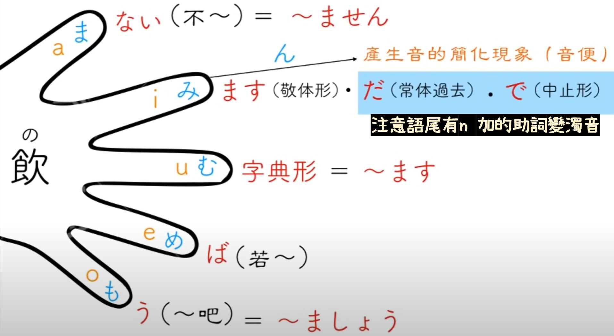|
| ら り る れ ろ|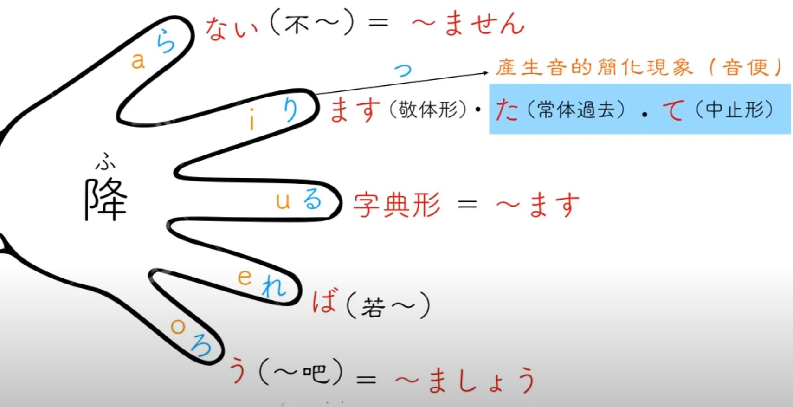|
