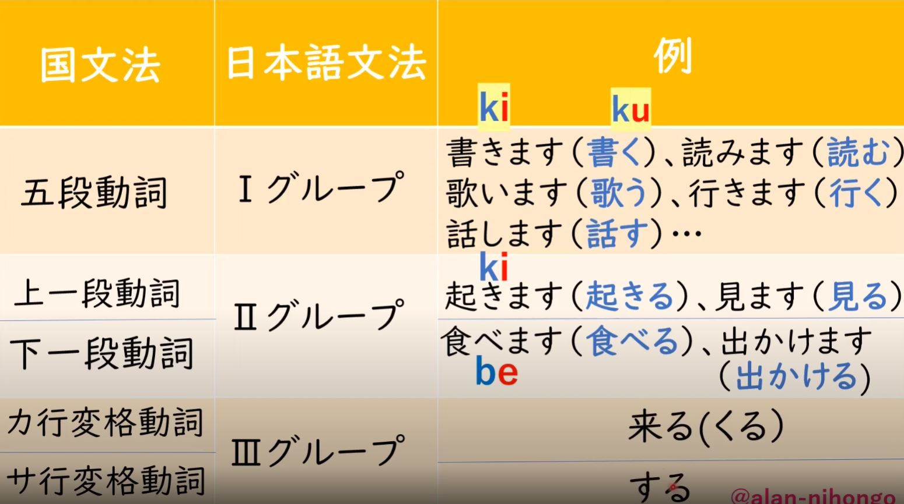
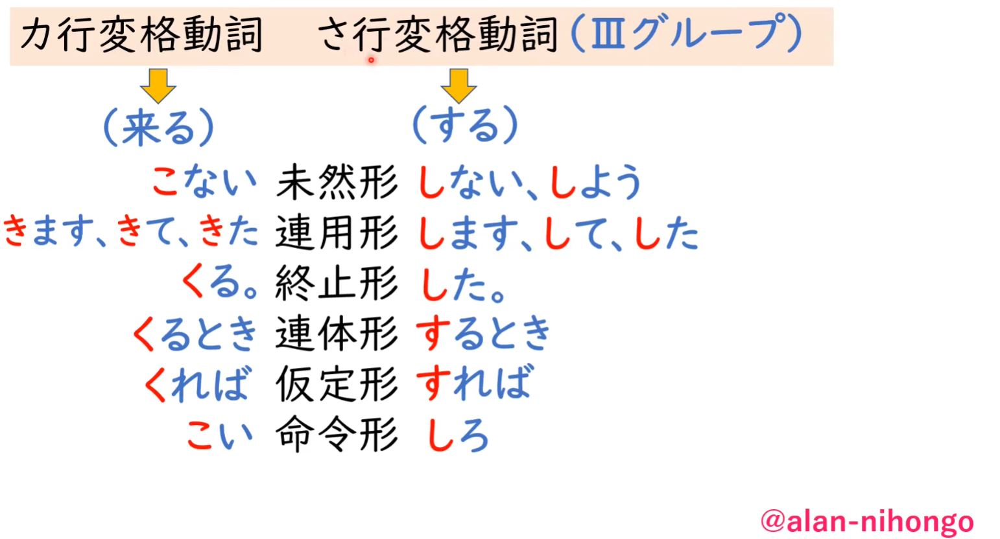
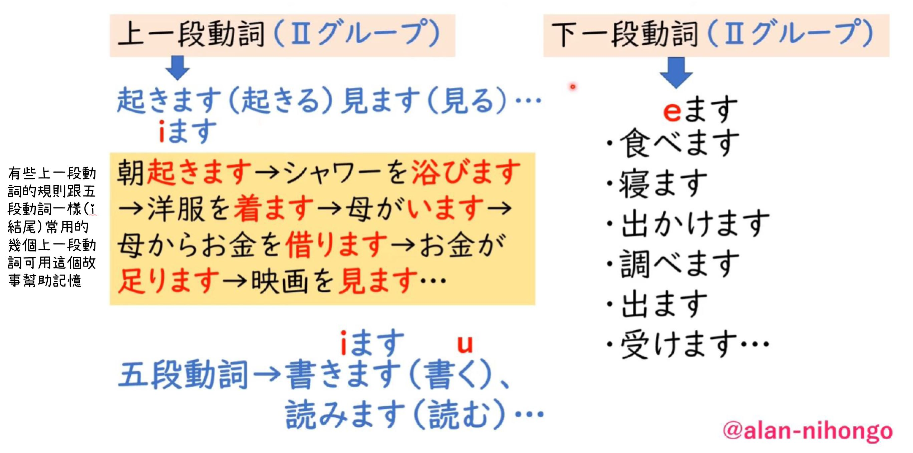
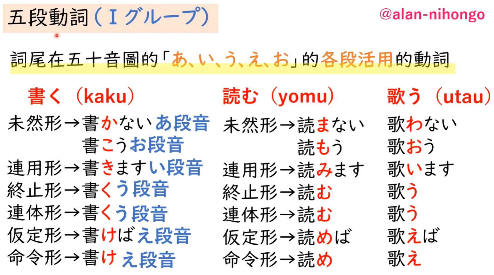
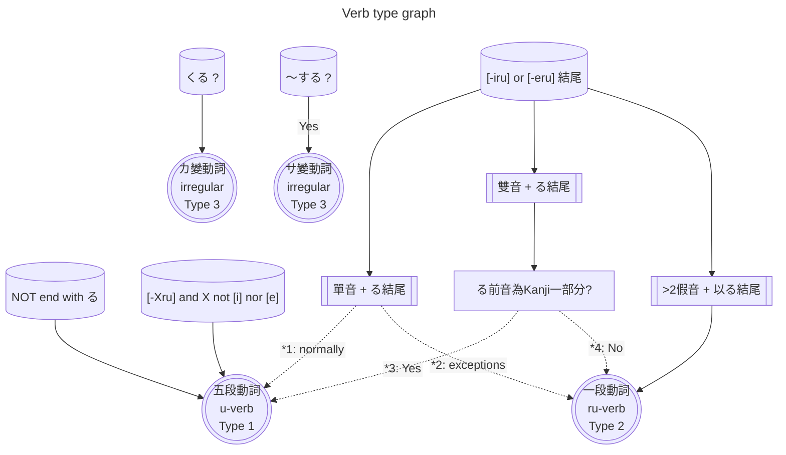

# 動詞種類(按照型態及變化規則)

- 在日語中，動詞需要變形才能表達特定的意思。在討論變形之前，我們必須了解日語動詞分類的基礎規則，因為不同類型的動詞會有不同的變形方式。
- 首先，我們要考慮一個問題：在漢語中，僅憑單詞的形態或發音，我們能否判斷它是否是一個動詞？
  - 答案是否定的。同樣的道理適用於英語。
  - 然而，在這一點上，日語顯得非常友好，因為日語動詞都有固定的特徵。
- 日語動詞特徵的一個大前提: 只要是動詞，肯定都是以帶有 u 這個發音的假名結尾。
- 日語動詞可以細分為四類，分別是五段動詞、一段動詞、サ變動詞和カ變動詞。
- - (這個排列的方式是通過動詞數量的多少來排列的 也就是說五段動詞在日語當中是最多的  サ變動詞在日語當中是最少的)
  - 這四種類型的動詞可以通過觀察詞型來判斷它是否屬於某一類別。

> 不同類別的動詞 針對不同的動詞變化 有不一樣的變化形式

|||
|--|--|
|カ行/サ行變格動詞 (Type 3)||
|上一段動詞/下一段動詞 (Type 2)||
|五段動詞 (Type 1)||

## 判斷動詞類別

- [*1]: 要る[iru] 知る[kiru] 切る[shiru] 減る[heru] 競る[heru]
- [*2]: 居る[iru] 見る[miru] 似る[niru] 経る[heru] 寝る[neru]。
- [*3]: 帰る[kaeru] 焦る[aseru] 走る[hashiru] 陥る[ochiiru]。
- [*4]: 変える[kaeru] 褪える[aseru]

### 動詞種類的基礎規則

- :tokyo_tower:**カ變動詞**：在日語中，屬於カ變動詞的動詞只有一個，就是「くる」（表示來的意思）。
- :tokyo_tower:**サ變動詞**：サ變動詞包括"一個"及"很多個"。只要記住帶有「する」的全部都是サ變動詞就可以了。
  - 所謂的"一個"就是「する」這個單詞。
  - 很多個則是所有帶有「する」的動詞，如散步する、勉強する、会計する、約束する、プレゼントする、ショッピングする、ドライブする。
  - 「する」的意思是做、幹、搞，有點像英文中的 do。
- :tokyo_tower:**一段動詞**：一段動詞的規則稍微複雜一點。它有兩個條件。
  - 首先，一段動詞必須以「る」這個假名結尾。如果沒有以「る」結尾，那麼它肯定不是一個一段動詞。
  - 第二個條件是，在「る」前面的假名（倒數第二個）要在「い」段或者「え」段上
    - 也就是要以「...iru」或者「...eru」結尾，才是一個一段動詞。
    - 例如，「かれる」這個單詞，以「る」結尾，倒數第二個假名「り」在「い」段上，所以它是一個一段動詞。同理，「おきる」（ok[iru]）、「たべる」（tab[eru]）、「おしえる」（oshi[eru]）和「はじめる」（hajim[eru]）也是一段動詞。
    - 反例：「はじまる」（hajim[aru]），因為它以「aru」結尾，所以它不是一個一段動詞。
- :tokyo_tower:**五段動詞**：要判斷一個動詞是否是五段動詞，其實非常簡單。除了上述三種（カ變、サ變、一段）之外，剩下的全部都是五段動詞。
  - 五段動詞是日語中數量最多的動詞。

### 動詞種類的特殊規則

在判斷日語動詞是一段動詞還是五段動詞時，我們需要注意兩條特殊規則：

> 特殊規則一: 當る前只有一個假名時，即使符合一段動詞特徵，大部分是五段動詞。

- 以下五個動詞本應是一段動詞，但實際上是五段動詞：要る[iru]、切る[kiru]、知る[shiru]、減る[heru]、競る[seru]。
- 以下五個動詞是一段動詞：居る[iru]、見る[miru]、似る[niru]、経る[heru]、寝る[neru]。
- 當一個動詞前只有一個假名時，即使符合一段動詞特徵，大部分仍是五段動詞。
- 少部分是一段動詞，遇到時需要一個個記住。

> 特殊規則二: 當る前有兩個或以上假名時，即使符合一段動詞特徵，假名在漢字上方則是五段動詞，假名在漢字下方則是一段動詞。

- 左邊的帰る[kaeru]（五段動詞）和右邊的変える[kaeru]（一段動詞）的假名完全相同。
- 左邊的焦る[aseru]（五段動詞）和右邊的褪せる[aseru]（一段動詞）的發音完全相同。
- 只要假名在漢字上方(e.g. 帰[ka`e`], 焦[as`e`])，則是五段動詞；反之，假名在漢字下方(変[ka]え, 褪[a]せ)，則是一段動詞。

- 同理: 走る[`hashi`ru]和陥る[`ochii`ru]均是五段動詞，因為假名在漢字上方。
- 漢字在日語中具有重要地位，幫助我們區分五段和一段動詞。如果沒有漢字，兩者的假名可能完全相同，讓我們無法區分。
