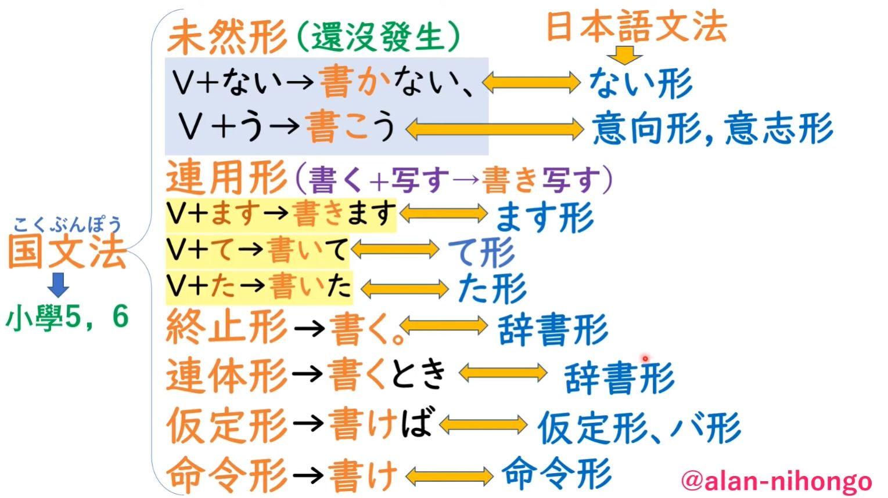

# 動詞活用變化

Notes from ...

- [看圖表學日語文法](https://www.books.com.tw/products/0010881639)
- [小一语言教室](https://youtu.be/rMQuYBBuqrM)
- [alan 日語](https://youtu.be/bxOD6nLH8rY)

---

在學習日語時，我們必須理解**活用**和**接續**的概念。

- 在日語中，所有的詞形變化都是為了接續詞語。
- 接續是指當構成句子時，動詞後面可能會跟一些**助詞或助動詞，我們需要用正確的形式來接續它們。**

- **不同的助詞或助動詞要求不同的詞形變化**來做接續。我們必須遵循助詞助動詞的要求來使用正確的詞形變化來接續它們。
  - 例如，有一個接續助詞叫做「`ながら`」，它要求使用動詞的「ます」形的連用型來接續。因此，當接續「`ながら`」和動詞「くる」時，我們要使用「き`ながら`」。
  - 另一個表示可能或被動的助動詞「`られる`」要求使用未然型來接續，所以當接續到動詞「くる」時，我們要使用「こ`られる`」而不是「き`られる`」。
  - 另外，引用內容的助詞「と」要求動詞使用終止型來接續，例如「くると思います」表示「我認為他會來」。
  - 假定型通常只在接續助詞「ば」時使用，而其他助詞或助動詞通常不要求使用假定型。
  - 命令型是一種單獨的形式，用於表示命令，助詞和助動詞通常不要求使用命令型來接續。
  - 連體型通常用於表示「好像」的「ようだ」等情況，需要使用動詞的連體型來接續。

## 兩種分類動詞活用變化的方法

第一種把變化分成6種形式，主要**描述動詞在句子結構中的功能。**

6種形式

| 形式   | 英文名稱                       | 說明                                                               |
|------|--------------------------------|------------------------------------------------------------------|
| 連用形 | Continuative Form (Renyou-kei) | 這種形式用於連接兩個動詞，表示連續的動作，也用於形成ます　て　た形。             |
| 未然形 | Irrealis Form (Mizen-kei)      | 這種形式主要用於否定形式（ない形）和意志形。它表示尚未實現的動作或意圖。 |
| 假定形 | Conditional Form (Katei-kei)   | 這種形式用於表示條件、假設或建議，常與「ば」搭配使用。                   |
| 命令形 | Imperative Form (Meirei-kei)   | 這種形式表示命令、要求或建議。                                       |
| 終止形 | Terminal Form (Shuushi-kei)    | 這是動詞的基本形式，也被稱為辭書形。它表示動作的終結。                |
| 連體形 | Attributive Form (Rentai-kei)  | 這種形式用於描述名詞，表示動詞與名詞之間的關係。                     |

|動詞類型| 字典形 (Romaji) | 連用形 (Romaji) | 未然形 (Romaji) | 假定形 (Romaji) | 命令形 (Romaji) | 終止形 (Romaji) | 連體形 (Romaji) |
|--|----------------|----------------|----------------|----------------|----------------|----------------|----------------|
|カ變動詞| くる (Kuru)      | き (Ki)          | こ (Ko)          | くれ (Kure)      | こい (Koi)        | くる (Kuru)      | くる (Kuru)      |
|サ變動詞| する (Suru)      | し (Shi)         | せ (Se)          | すれ (Sure)      | しろ (Shiro)     | する (Suru)      | する (Suru)      |
|一段動詞| 起きる (Okiru)    | 起き (Okiki)     | 起き (Okiki)     | 起きれ (Okire)   | 起きろ (Okiro)   | 起きる (Okiru)    | 起きる (Okiru)    |
|| 食べる (Taberu)  | 食べ (Tabeki)    | 食べ (Tabeki)    | 食べれ (Tabere)  | 食べろ (Tabero)  | 食べる (Taberu)  | 食べる (Taberu)  |
|五段動詞| 聞く (Kiku)      | 聞き (Kiki)      | 聞か (Kika)      | 聞け (Kike)      | 聞け (Kike)      | 聞く (Kiku)      | 聞く (Kiku)      |
|| 読む (Yomu)      | 読み (Yomi)      | 読ま (Yoma)      | 読め (Yome)      | 読め (Yome)      | 読む (Yomu)      | 読む (Yomu)      |
|| 話す (Hanasu)    | 話し (Hanashi)   | 話さ (Hanasa)   | 話せ (Hanase)   | 話せ (Hanase)   | 話す (Hanasu)    | 話す (Hanasu)    |
|| 押す (Osu)      | 押し (Oshi)      | 押さ (Osa)      | 押せ (Ose)      | 押せ (Ose)      | 押す (Osu)      | 押す (Osu)      |

第二種把變化分成12種形式，主要關注動詞的各種變化。

12種形式

| 變化形式   | 英文名稱                                 | 說明                                                                  |
|-----------|------------------------------------------|---------------------------------------------------------------------|
| 辭書形     | Dictionary Form (Jisho-kei)              | 這是動詞的基本形式，用於查詞典。也稱為未然形（Mizen-kei）。                |
| ます形       | Polite Form (Masu-kei)                   | 這是一種禮貌語氣，用於與他人交流時表達尊敬。                            |
| て形        | Te Form (Te-kei)                         | 這種形式用於連接動詞、表示原因或理由，或用於請求和命令。                 |
| た形        | Past Form (Ta-kei)                       | 這是過去時態的表示，用於表示動作已經完成或情況已經發生。                |
| ない形       | Negative Form (Nai-kei)                  | 這種形式表示動詞的否定，即動作或狀態沒有發生。                          |
| 意志形     | Volitional Form (Ishi-kei)               | 這種形式表示意圖或打算執行某個動作。通常用於第一人稱。                  |
| 假定形     | Conditional Form (Katei-kei)             | 這種形式表示假設或條件，用於表示如果某個條件得到滿足，就會引發某種結果。 |
| 命令形     | Imperative Form (Meirei-kei)             | 這種形式用於對他人下達指示或命令。                                     |
| 可能形     | Potential Form (Kanou-kei)               | 這種形式表示能力或可能性，用於表示動作或狀態可能發生。                  |
| 受動形/受身形     | Passive Form (Judo-kei)                  | 這種形式表示被動語態，用於表示動作的承受者。                            |
| 使役形     | Causative Form (Shieki-kei)              | 這種形式表示使役語態，用於表示讓、叫某人做某事。                            |
| 使役受動形 | Causative Passive Form (Shieki Judo-kei) | 這是使役形和受動形的結合，表示被迫做某事。                              |

| 變化形式     | 日文例句                      | 中文翻譯                    |
|-------------|----------------------------|-------------------------|
| 辭書(字典)形 | 戀人に手紙を`書く`               | 給戀人寫信                  |
| ます形         | 大切な人に感謝の手紙を`書きます`     | 給重要的人寫感謝信（禮貌語）  |
| て形          | 感動したので、手紙を`書いて`感謝を伝える | 因為感動了，寫信表達感謝     |
| た形          | 小説を`書いた`ことで、彼女の心が癒された  | 通過寫小說，她的心得到了治癒 |
| ない形         | 愛情を`書かない`手紙              | 沒有寫愛情的信              |
| 意志形       | 今度、詩を`書こう`                | 這次要寫首詩                |
| 假定形       | 友達に手紙を`書けば`、きっと喜ぶだろう    | 如果給朋友寫信，他一定會高興 |
| 命令形       | お父さんに感謝の手紙を`書け`！        | 給爸爸寫封感謝信！           |
| 可能形       | 小説が`書ける`                   | 能寫小說                    |
| 受動形       | 彼に手紙が`書かれた`               | 他被寫了信                  |
| 使役形       | 子供に日記を`書かせる`             | 讓孩子寫日記                |
| 使役受動形   | 彼女は彼に日記を`書かされた`         | 她被他逼寫日記              |

雖然12種和6種分類方法有一定程度的重疊，但它們的重點和組織方式有所不同。

對應表格(僅供參考)

以下是嘗試將它們對應的列表，但請注意，這些對應關係並不完全一致(僅供參考)，因為這兩個分類方法有不同的目的。

| 變化形式     | 別名   | 英文名稱               | 用途               | 例子 (見る) | 例句          | 大致對應的形式 (6種) |
|-------------|--------|------------------------|------------------|-----------|-------------|-------------------|
| 辭書(字典)形 | 終止形 | Dictionary form        | 一般現在時或未來時 | 見る        | 映畫を見る。     | 終止形、連體形        |
| ない形         | 未然形 | Negative form          | 否定               | 見ない       | 映畫を見ない。    | 未然形               |
| 意志形       | -      | Volitional form        | 表示意願           | 見よう       | 映畫を見よう。    | 未然形、命令形        |
| ば形          | -      | Conditional form       | 假設               | 見れば       | 映畫を見ればいい。  | 未然形、假定形        |
| ます形         | 連用形 | Masu form              | 敬語現在時或未來時 | 見ます       | 映畫を見ます。    | 連用形               |
| て形          | -      | Te form                | 連接、進行、請求     | 見て        | 映畫を見て。     | 連用形               |
| た形          | -      | Ta form                | 過去時             | 見た        | 映畫を見た。     | 連用形               |
| たい形         | -      | Desire form            | 表示想要           | 見たい       | 映畫を見たい。    | 連用形               |
| 可能形       | -      | Potential form         | 表示可能性         | 見られる      | 映畫が見られる。   | 連用形               |
| 受身形       | -      | Passive form           | 表示被動           | 見られる      | 映畫が見られる。   | 連用形               |
| 使役形       | -      | Causative form         | 表示使役           | 見させる      | 映畫を見させる。   | 連用形               |
| 使役受身形   | -      | Causative-passive form | 表示使役被動       | 見させられる    | 映畫を見させられる。 | 連用形               |

- 另外一種說法: (日本人小學文法: 國文法 / 日本教外國人的文法: 日本與文法 有對應的關係 from [alan 日語video](https://youtu.be/bxOD6nLH8rY))

## ます形 / 連用型1

- 五段動詞的連用型有兩種，一種用來接ます，另一種用來接て，兩者都被稱為連用型。一般來說，許多書籍會把連用型1稱為ます形。
- ます形（也稱為敬語形）主要用於以下情況：
  - 禮貌語境：當與上司、老師、客人或陌生人交流時，需要使用ます形來表達尊敬和禮貌。
  - 敬語：ます形是敬語的一種，可以用來表達尊敬、謙虛或禮貌。
  - 格式要求：在正式場合、文章、信件或報告等場閤中，使用ます形可以使語言顯得更加正式和規範。
  - 現在或未來的行為：ます形可以用來表示正在進行的行為或將來要發生的行為。
- 總之，ます形主要在禮貌、正式或需要表達尊敬的場閤中使用。在與朋友、家人或熟人交流時，通常使用普通形（非敬語形式）。
- 真正意義上的ます形 是"用來接ます的形式"
  - 例如：動詞`買う`變成ます形後會變成`買います`。真正的ます形是去掉ます的部分，也就是`買い`。
  - 注意：有時為了方便，也有一些老師會把`買います`這個整體稱為ます形，但實際上真正的ます形只有去掉ます`買い`。
- ます形除了能接ます以外，還能接其他助詞，例如接續助詞ながら，也需要使用ます形。

**變成ます形的方法**

カ變動詞

- 只有一個 くる (kuru) -> きます (kimasu)
- 雖然它的原型和ます形 都寫成”來”這個字，但讀音不同: 原形是讀成く，ます形是讀成き

字典形 (Romaji) | ます形變 (Romaji)
----------------|--------------
くる (kuru)       | きます (kimasu)

サ變動詞

- する (suru) -> します (shimasu)

| 字典形 (Romaji)           | ます形變 (Romaji)               |
|---------------------------|-------------------------------|
| する (suru)                 | します (shimasu)                 |
| 勉強する (benkyou suru)     | 勉強します (benkyou shimasu)     |
| プレゼントする (purezento suru)  | プレゼントします (purezento shimasu)  |
| ショッピングする (shoppingu suru) | ショッピングします (shoppingu shimasu) |

一段動詞

- 以いる或える結尾的動詞。變成ます形的方法為：去る+ます。

| 字典形 (Romaji) | ます形變 (Romaji)   |
|----------------|------------------|
| 起きる (okiru)    | 起きます (okimasu)   |
| 伸びる (nobiru)   | 伸びます (nobimasu)  |
| 食べる (taberu)   | 食べます (tabemasu)  |
| 教える (oshieru)  | 教えます (oshiemasu) |

五段動詞

- 除了カ變、サ變和一段動詞之外的動詞都是五段動詞。
- 變成ます形的方法為：將詞尾的う段假名變成い段假名，再加上ます。

| 字典形 (Romaji) | ます形 (Romaji)       |
|----------------|--------------------|
| 聞く (kiku)      | 聞きます (kikimasu)    |
| 泳ぐ (oyogu)     | 泳ぎます (oyogimasu)   |
| 死ぬ (shinu)     | 死にます (shinimasu)   |
| 読む (yomu)      | 読みます (yomimasu)    |
| 遊ぶ (asobu)     | 遊びます (asobimasu)   |
| 買う (kau)       | 買います (kaimasu)     |
| 待つ (matsu)     | 待ちます (machimasu)   |
| 作る (tsukuru)   | 作ります (tsukurimasu) |
| 話す (hanasu)    | 話します (hanashimasu) |
| 行く (iku)       | 行きます (ikimasu)     |

## て/た形 / 連用型2

て形（て形）和な形（た形）在不同的語境中有不同的用途。以下是一些常見的情況：

:small_blue_diamond:て形：

- 表示動作的連續：當你想表達兩個或多個動作按順序發生時，可以使用て形將這些動詞連接在一起。
  - 例如：「買い物に行って、映畫を見る」（買いものにいって、えいがをみる）意為「去購物然後看電影」。
- 表示請求、命令或建議：你可以在て形後面加上「ください」來表示請求，或者使用「てください」來表達命令或建議。
  - 例如：「待ってください」（まってください）意為「請等待」。
- 表示原因或理由：你可以使用て形來表示原因或理由。
  - 例如：「雨が降って、試合が中止になった」（あめがふって、しあいがちゅうしになった）意為「因為下雨，比賽被取消了」。

:small_blue_diamond:た形：

- 表示過去完成：た形用於表示過去的動作或狀態已經完成。
  - 例如：「昨日、友達に會った」（きのう、ともだちにあった）意為「昨天見了朋友」。
- 表示假設條件：た形也可以用來表示假設條件，通常與「ら」一起使用。
  - 例如：「日本に行ったら、壽司を食べたい」（にほんにいったら、すしをたべたい）意為「如果去日本，我想吃壽司」。

這兩種て/た形的變化是完全一樣的，只不過一個接上的是て，一個接上的是た。下面以て型為例解釋變化規則。

カ變動詞

- カ變動詞: くる的て形是きて。
- 去掉て的形式就是我們要的て形，即き。くる的ます型也是き。
- 因此，ます型和て型都是き (也因此都是這兩形都是連用型)。

| 字典形 (Romaji) | て形變 (Romaji) | た形變 (Romaji) |
|-----------------|----------------|----------------|
| くる (Kuru)       | きて (Kite)      | きた (Kita)      |

サ變動詞

- サ變動詞する的て形是して。只要把所有帶有する的全部都變成して就可以了。
- 去掉て的形式就是我們要的て形，即し。する的ます型也是し。
- 所以，ます形和て形都是し　(也因此都是這兩形都是連用型)

|      字典形 (Romaji)      |       て形變 (Romaji)       |       た形變 (Romaji)       |
|:-------------------------:|:--------------------------:|:--------------------------:|
|         する (suru)         |         して (shite)         |         した (shita)         |
|   勉強する (benkyou suru)   |   勉強して (benkyou shite)   |   勉強した (benkyou shita)   |
| プレゼントする (purezento suru)  | プレゼントして (purezento shite)  | プレゼントした (purezento shita)  |
| ショッピングする (shoppingu suru) | ショッピングして (shoppingu shite) | ショッピングした (shoppingu shita) |

一段動詞

- 以いる或者える的發音結尾的動詞是一段動詞。判斷出一段動詞後，變成て形非常簡單，就像ます形一樣，去る加て。
- 但要注意，變成て形後，一段動詞的聲調可能會改變。一般來講，一段動詞變成て形後，加上這個て的單詞的第一個音節會讀成重音。

| 字典形 (Romaji) | て形變 (Romaji) | た形變 (Romaji) |
|----------------|---------------|---------------|
| 起きる (okiru)    | 起きて (okite)   | 起きた (okita)   |
| 伸びる (nobiru)   | 伸びて (nobite)  | 伸びた (nobita)  |
| 食べる (taberu)   | 食べて (tabete)  | 食べた (tabeta)  |
| 教える (oshieru)  | 教えて (oshiete) | 教えた (oshieta) |

五段動詞

- 判斷出五段動詞後，按照五段動詞的規則來變て形。五段動詞根據不同的詞位發生不同的音便後，再加上て或者で。
- 五段動詞的て形規則如下：
  - 以く、ぐ結尾的 -> い音便 + て
  - 以ぬ、む、ぶ結尾的 -> 撥音ん便 + で
  - 以う、つ、る結尾的 -> 促音っ便 + て
  - 以す結尾的 -> し + て
- 在て形中，只有這一個單詞是例外(需要硬背): 行く。
  - 行く是以く結尾的，按照規則應該是い音便，然後加上て。
  - 但實際上，行く的て形是行って，也就是說它沒有發生い音便，而是發生促音便。

| 字典形 (Romaji) | て形 (Romaji)     | た形 (Romaji)     |
|----------------|-----------------|-----------------|
| 聞く (kiku)      | 聞いて (kiite)     | 聞いた (kiita)     |
| 泳ぐ (oyogu)     | 泳いで (oyoide)    | 泳いだ (oyoida)    |
| 死ぬ (shinu)     | 死んで (shinde)    | 死んだ (shinda)    |
| 読む (yomu)      | 読んで (yonde)     | 読んだ (yonda)     |
| 遊ぶ (asobu)     | 遊んで (asonde)    | 遊んだ (asonda)    |
| 買う (kau)       | 買って (katte)     | 買った (katta)     |
| 待つ (matsu)     | 待って (matte)     | 待った (matta)     |
| 作る (tsukuru)   | 作って (tsukutte)  | 作った (tsukutta)  |
| 話す (hanasu)    | 話して (hanashite) | 話した (hanashita) |
| 行く (iku)       | 行って (itte)      | 行った (itta)      |

## ない形 / 未然形1

- 未然形分為兩種形式：一種是ない形，另一種是意志形。

カ變動詞

- カ變動詞的ない形：「くる」會變成「こない」。
- 一定要記住「くる」這個單詞，變成ない形後，讀音會變成「こない」（儘管漢字不變, “來”）。
- 大家還記得「くる」的連用形是什麼嗎？它的讀音不是「き」。所以連用形和未然形是不一樣的。

| 字典形 (Romaji) | ない形 (Romaji) |
|-----------------|---------------|
| くる (kuru)       | こない (konai)   |

サ變動詞

- 所有帶有「する」的詞都屬於サ變動詞。
- サ變動詞變成ない形: 「する」會變成「しない」。

| 字典形 (Romaji)           | ない形 (Romaji)                |
|---------------------------|------------------------------|
| する (suru)                 | しない (shinai)                 |
| 勉強する (benkyou suru)     | 勉強しない (benkyou shinai)     |
| プレゼントする (purezento suru)  | プレゼントしない (purezento shinai)  |
| ショッピングする (shoppingu suru) | ショッピングしない (shoppingu shinai) |

一段動詞

- 一段動詞是以「る」結尾的，如「いる」或「える」。
- 要將一段動詞變成ない形，只需去掉「る」並加上「ない」。

| 字典形 (Romaji) | ない形 (Romaji)      |
|----------------|-------------------|
| 起きる (okiru)    | 起きない (okina-i)    |
| 伸びる (nobiru)   | 伸びない (nobina-i)   |
| 食べる (taberu)   | 食べない (tabena-i)   |
| 教える (oshieru)  | 教えない (oshierna-i) |

五段動詞

- 除了カ變動詞、サ變動詞、一段動詞之外，其餘都是五段動詞。
- 對於五段動詞，要將詞尾的「う」段假名變成「あ」段假名後再加上「ない」。
- 需要注意的是，如果詞彙以「う」假名結尾，應將其變成「わ」行的「わ」，而不是「あ」行的「あ」。因此，「かう」會變成「かわない」。 (五十音圖當中最後一行，就叫做わいうえお。E.g. 不僅あ行裡邊有う這個發音。)

| 字典形 (Romaji) | ない形 (Romaji)      |
|----------------|-------------------|
| 聞く (kiku)      | 聞かない (kikanai)    |
| 泳ぐ (oyogu)     | 泳がない (oyoganai)   |
| 死ぬ (shinu)     | 死なない (shinanai)   |
| 読む (yomu)      | 読まない (yomanai)    |
| 遊ぶ (asobu)     | 遊ばない (asobanai)   |
| 買う (kau)       | 買わない (kawanai)    |
| 待つ (matsu)     | 待たない (matanai)    |
| 作る (tsukuru)   | 作らない (tsukuranai) |
| 話す (hanasu)    | 話さない (hanasanai)  |
| 行く (iku)       | 行かない (ikanai)     |

## う/よう形 / 意志形 / 未然形2

- 之前學的ます形、て形和ない形，雖然不同類型的動詞有不同的變化規則，但它們添加的結尾都是相同的。
  - 例如，ます形對於カ變動詞、サ變動詞、一段動詞和五段動詞，都是變成連用形後再加上「ます」。
- 但意志形有點特殊，它會根據不同的動詞加上不同的助動詞，也就是說有些動詞會加上「う」，有些動詞會加上「よう」。
- 規則是：除了五段動詞以外的カ變動詞、サ變動詞和一段動詞都加上「よう」，而五段動詞則加上「う」。

カ變動詞

- 意志形會把「くる」變成「こよう」。
- 還記得「くる」的ない形是什麼嗎？是「こない」，讀音也是「こ」。所以ない形和意志形都被稱為未然形，因為它們有一定的關聯。

| 字典形 (Romaji) | 意志形變 (Romaji) |
|-----------------|-------------------|
| くる (kuru)       | こよう (koyou)       |

サ變動詞

- 意志形會把「する」變成「しよう」。

| 字典形 (Romaji)           | 意志形變 (Romaji)            |
|---------------------------|------------------------------|
| する (suru)                 | しよう (shiyou)                 |
| 勉強する (benkyou suru)     | 勉強しよう (benkyou shiyou)     |
| プレゼントする (purezento suru)  | プレゼントしよう (purezento shiyou)  |
| ショッピングする (shoppingu suru) | ショッピングしよう (shoppingu shiyou) |

一段動詞

- 以「いる」或「える」發音結尾的詞，變成意志形的方式是去掉「る」，再加上「よう」。

| 字典形 (Romaji) | 意志形變 (Romaji) |
|----------------|------------------|
| 起きる (Okiru)    | 起きよう (Okuyou)    |
| 伸びる (Nobiru)   | 伸びよう (Nobiyou)   |
| 食べる (Taberu)   | 食べよう (Tabeyou)   |
| 教える (Oshieru)  | 教えよう (Oshiyou)   |

五段動詞

- 將詞尾的「う」段假名變成「お」段假名，然後再加上「う」。
- 注意加上的是「う」，而不是「よう」。在變化後，[ou] 會讀成一條長音「お」的發音。

| 字典形 (Romaji) | 意志形 (Romaji) |
|----------------|----------------|
| 聞く (Kiku)      | 聞こう (Kikou)    |
| 泳ぐ (Oyogu)     | 泳ごう (Oyogou)   |
| 死ぬ (Shinu)     | 死のう (Shinou)   |
| 読む (Yomu)      | 読もう (Yomou)    |
| 遊ぶ (Asobu)     | 遊ぼう (Asobou)   |
| 買う (Kau)       | 買おう (Kaou)     |
| 待つ (Matsu)     | 待とう (Matou)    |
| 作る (Tsukuru)   | 作ろう (Tsukurou) |
| 話す (Hanasu)    | 話そう (Hanasou)  |
| 行く (Iku)       | 行こう (Ikou)     |

## ば形/假定形

- 之前的所有變形都是根據不同的動詞使用不同的變化規則，特別是一段動詞和五段動詞。一段動詞一般來說都是把る去掉，五段動詞則是把詞尾的う段假名變成其他段的假名。
- 但是ば形這個假定型呢，它不區分動詞。也就是說，カ變動詞、サ變動詞、一段動詞和五段動詞的變化規則都是一樣的。所
- 那麼ば形的變化規則是什麼呢？就是不區分動詞，只要把詞尾的う段假名變成え段假名之後，加上一個ば就可以了。
- 以下還是依不同動詞舉例 但實際上變化規則都是相同的

カ變動詞

| 字典形 (Romaji) | 假定形變 (Romaji) |
|-----------------|-------------------|
| くる (Kuru)       | くれば (Kureba)      |

サ變動詞

| 字典形 (Romaji)           | 假定形變 (Romaji)            |
|---------------------------|------------------------------|
| する (suru)                 | すれば (sureba)                 |
| 勉強する (benkyou suru)     | 勉強すれば (benkyou sureba)     |
| プレゼントする (purezento suru)  | プレゼントすれば (purezento sureba)  |
| ショッピングする (shoppingu suru) | ショッピングすれば (shoppingu sureba) |

一段動詞

| 字典形 (Romaji) | 假定形變 (Romaji) |
|----------------|------------------|
| 起きる (Okiru)    | 起きれば (Okireba)   |
| 伸びる (Nobiru)   | 伸びれば (Nobireba)  |
| 食べる (Taberu)   | 食べれば (Tabereba)  |
| 教える (Oshieru)  | 教えれば (Oshiereba) |

五段動詞

| 字典形 (Romaji) | 意志形 (Romaji) |
|:--------------:|:--------------:|
|   聞く (kiku)    |   聞け (kike)    |
|   泳ぐ (oyogu)   |  泳ごう (oyogou)  |
|   死ぬ (shinu)   |  死のう (shinou)  |
|   読む (yomu)    |  読もう (yomou)   |
|   遊ぶ (asobu)   |  遊ぼう (asobou)  |
|    買う (kau)    |   買おう (kaou)   |
|   待つ (matsu)   |  待とう (matou)   |
|  作る (tsukuru)  | 作ろう (tsukurou) |
|  話す (hanasu)   | 話そう (hanasou)  |
|    行く (iku)    |   行こう (ikou)   |

## 命令形

- 和我們之前學習的其他變形不一樣，命令形變完這個形式後它就不需要再加上一個助動詞了。
- 命令型的變化幾乎沒有什麼特別大的規律，所以每一種類型的動詞都要單獨去記憶。

カ變動詞

| 字典形 (Romaji) | 命令形變 (Romaji) |
|-----------------|-------------------|
| くる (kuru)       | こい (koi)          |

サ變動詞

- サ變動詞 する會變成 しろ或者 せよ。那麼這兩個有什麼區別呢？しろ會比較偏向口語，せよ會比較偏向書面語。せよ在口語中幾乎不使用。

| 字典形 (Romaji)           | 命令形變 (Romaji)          |
|---------------------------|----------------------------|
| する (suru)                 | しろ (shiro)                 |
|                           | せよ (seyo)                  |
| 勉強する (benkyou suru)     | べんきょうしろ (benkyou shiro)    |
|                           | 勉強せよ (benkyou seyo)      |
| プレゼントする (purezento suru)  | プレゼントしろ (purezento shiro)  |
|                           | プレゼントせよ (purezento seyo)   |
| ショッピングする (shoppingu suru) | ショッピングしろ (shoppingu shiro) |
|                           | ショッピングせよ (shoppingu seyo)  |

一段動詞

- 一段動詞的命令型和せ變動詞是一樣的，也有兩種形式：一種是帶ろ的，一種是帶よ的。它們的區別和剛才說的一樣，ろ比較偏向口語，よ比較偏向書面語。
- 因此，「起きる」的命令型會變成「起きろ」或「起きよ」。當然，第二種形式在口語中幾乎不會使用到。
- 如果看動畫片的話，可能會聽到第二種命令型。有些動畫片裏會召喚一些什麼神獸之類的，就會聽到覺醒什麼東西，這時候就會用到「めざめよ」。這個「よ」就是用到了一段動詞的第二種命令型。這種命令型會比較偏向書面語或古語的感覺。在動畫片裏面，爲了塑造一個場景的時候，是會使用到第二種命令型的，但是在現實生活中，一般都是使用前面的這一種命令型。
- 一個例外的單詞是「くれる」，它不會變成「くれろ」，而是會變成「くれ」，就是把「る」給去掉，直接就變成了它的命令型了。

| 字典形 (Romaji) | 命令形變 (Romaji) |
|-----------------|-------------------|
| 起きる (Okiru)    | 起きろ (Okiro)      |
| 伸びる (Nobiru)   | 伸びろ (Nobiro)     |
| 食べる (Taberu)   | 食べろ (Tabero)     |
| 教える (Oshieru)  | 教えろ (Oshiero)    |
| くれる (Kureru)    | くれ (Kure)         |

五段動詞

- 五段動詞的命令型就是把詞尾的「う」段假名變到「え」段假名。

| 字典形 (Romaji) | 意志形 (Romaji) |
|:--------------:|:--------------:|
|   聞く (kiku)    |   聞け (kike)    |
|   泳ぐ (oyogu)   |  泳ごう (oyogou)  |
|   死ぬ (shinu)   |  死のう (shinou)  |
|   読む (yomu)    |  読もう (yomou)   |
|   遊ぶ (asobu)   |  遊ぼう (asobou)  |
|    買う (kau)    |   買おう (kaou)   |
|   待つ (matsu)   |  待とう (matou)   |
|  作る (tsukuru)  | 作ろう (tsukurou) |
|  話す (hanasu)   | 話そう (hanasou)  |
|    行く (iku)    |   行こう (ikou)   |

## 終止形、連體形

- 動詞在日語中的終止形和連體形就是動詞的原形。
- 終止形是指動詞用作謂語放在句末的形式，表示句子的結束。在日語中，動詞可以直接用作謂語，不需要變化，因此終止形就是動詞的原形。
- 連體形則是指動詞用來連接名詞的形式，也就是動詞用來修飾名詞的形式，又稱作定語形式。在日語中，動詞可以直接用來修飾名詞，因此連體形也是動詞的原形。

- 儘管動詞的中止型和連體型是相同的，但這兩種形式的區分仍然是必要的。
  - 因為在日語中，除了動詞外的其他活用詞，如形容詞和助動詞，都有各自的變化形式。當使用形容詞來表達「和」的意思時，需要使用其中止型。
  - 例如，將形容詞「きれい」和「と」連接起來，需要使用中止型，即「きれいだ と」。而當使用形容詞「よう」時，需要使用其連體型，即「きれいな ようだ」。

我們在學習日語的時候 一定要有活用的概念和接續的概念　日語當中所有的變形都是爲了接序 那什麼叫做接序 比如說動詞くる 我們在構成一個句子的時候 有的時候它後面會出現一些助詞 或者助動詞 那麼如何去連接後面跟着的助詞 或者助動詞的這一件事情就叫做接序 那麼不同的助詞或者助動詞 所要求你使用到的形式是不一樣的 具體這一個助詞或者助動詞 要使用到哪一種變型 是根據助詞助動詞的不同而不同的 有些助詞助動詞 它就會要求你使用連用型 有些就是未然型 有些就是中止型 有些就是連體型　這個助詞助動詞需要你用哪種形式接序 你就要用哪種形式接序

比如說有一個接序助詞 它叫做ながら 那麼ながら這個接序助詞 它要求你使用到動詞的加ます的連用型來接序 所以我們くる要加上ながら的話 它會變成きながら 

比如說像這個表示可能或者被動的 られる 它也要求你使用到的是未然型來接序　所以くる加上られる 就會變成こられる 不會變成きられる

就比如說我們表示內容表示引用的と 它的前面就會使用到動詞的終止型來接序 比如說と思います。認爲覺得的意思 我認爲它會來 　くると思います　這時候と前面就會用到終止型來進行接序 

假定型一般來說只會和ば接序的時候使用到 基本上沒有別的助詞助動詞 會使用到假定型了 只有這一個 
 
命令型是單獨的 就是爲了表示一種命令 一般來說助詞和助動詞 不會要求使用到命令型來接序的

連體型　比如說ようだ表示好像的　 就會要求動詞使用連體型來接序

