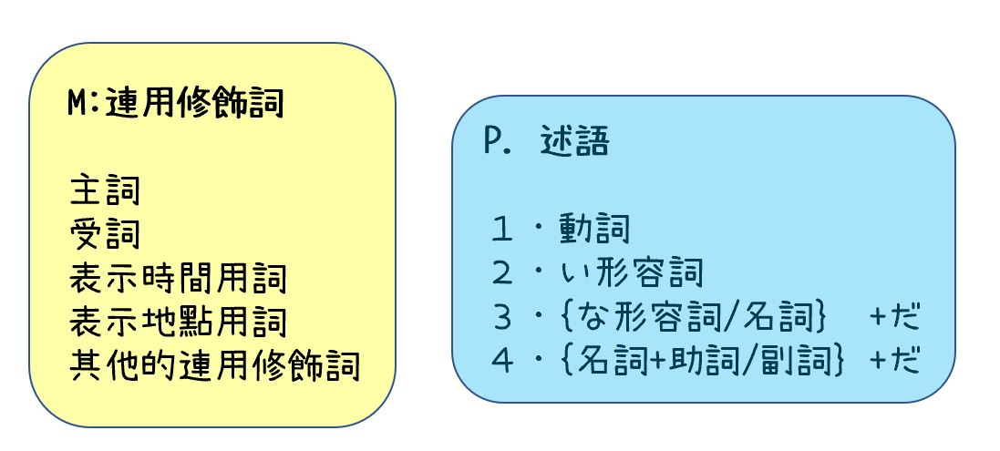

# Learning notes for [New System Japanese](https://newsystemjapanese.wixsite.com/patented/textbooks)

## 日語是由"述語"和"必要的修飾語"構成 (P.29)

- For example: "きのう本を買った"
  - 買った：述語
  - 本を： 連用修飾詞
  - きのう： 連用修飾詞
- e.g. 句子是由`一個述語 + 提供必須訊息的修飾詞`組成
- 注意: "提供必須訊息" implies "只添上需要的" 而不是"省略不需要/已經知道的"
- 注意: 沒有連用修飾語而只有述語的句子也成立
- 修飾詞 包含 主詞 受詞 連用修飾詞 (把主詞和受詞當作連用修飾語)
- 連用修飾詞中的主詞 受詞 以及其他修飾語在句子中的地位完全平等 沒有說主詞比較重要

## 更General的描述日文句子

- Let 述語 = p, 連用修飾語 = m
  - "きのう本を買った" 就是 `(m1 m2)*p` 的句型

- 依照希望傳達的資訊，可以把同樣的組成使用不同的排列組合如下描述
- 範例句: きのう蔦屋で本を買った
  - `m1` = きのう ... (ki-no-u) yesterday
  - `m2` = 蔦屋で ... (tsu-ta-ya-de) at Tsutaya (a bookstore)
  - `m3` = 本を ... (ho-n-wo) book
  - `p` = 買った ... (ka-tta) bought
  - "Yesterday, I bought a book at Tsutaya."

- 主題通常是用は來顯示。因為是主題，與全句相關，可以想成是修飾全句的修飾詞。
- 誰會是主題? 有可能是
  - A。連用修飾詞本身成為主題
  - B。[連用修飾詞+]述語成為主題

### A。連用修飾詞本身成為主題 - 把當主題的連用修飾詞加助詞は放在句首

- 蔦屋では きのう 本を 買った
  - (e.g. `(m2+は){(m1 m3)*p}`)
- きのうは 本~~を~~は 蔦屋で 買った
  - (e.g. `(m1+は)(m3+は){(m2)*p}`)

### B。[連用修飾詞+]述語成為主題 - 述語需要加上のは放在句首，連用修飾詞要傳遞的資訊之後附上だ成為新的述語

- きのう　蔦屋で　買った のは　本~~を~~だ
  - (e.g. `{(m1 + m2)*p + のは}*(m3+だ)` where 新術語產生: `(m3+だ) = p'`)
  - 以`(m1 + m2)*p`成為主題，這個句子希望傳遞的資訊為(新的述語)"本を"
- 本を 買った のは きのう だ
  - (e.g. `{m3*p + のは}*(m1+だ)` where 新術語產生: `(m1+だ) = p''`)
  - 以`m3*p`成為主題，這個句子希望傳遞的資訊為(新的述語)"きのう"

- 買った のは 蔦屋で だ
  - (e.g. `{p + のは}*(m2+だ)` where 新術語產生: `(m2+だ) = p'''`)
  - 以`p`成為主題，這個句子希望傳遞的資訊為(新的述語)"蔦屋で"

### 結論

- 英文的SVO表示時間地點的副詞的語序有明確的順序，日文則不然
- 在日文修飾詞的順序，越重要的要越靠近述語
- 另外，在英文中S或O來做為話題表面上並無不同，但日文會根據情況變化

> :brain: 述語定下後，在其前面放置需要的詞彙，才是日文建構的方式

- 日常生活用語遵循一樣的原則，定下述語，再添加上需要的詞。即使沒有添加，也是足夠的句子了(但重點是述語是不可以省略的)。回答時遵循這樣的原則，盡量簡短。
  - きのうはどこへ行ったんだすか。"Where did you go yesterday?"
    - 動物園へ行ったんです "I went to the zoo." =>　動物園です　"Zoo."

## [ぶん(句子)種類](about_sentence.md)

## [どうし(動詞)](about_verb.md)

## [けいようし(形容詞)](about_adj.md)

## [じょし(助詞)](about_particle.md)

## だいめいし(代名詞)

- 我: わたし (女) / ぼく (男)
  - 提到說話者 只有必要的時候才會加上 (一般大家都知道在講你自己的時候可以省略)
  - 男性用語在很正式的情況也可以用わたし

## [せつぞくし(接續詞)](about_conjunction.md)

## [こそあど系列詞](about_cosoato.md)

## [そのた (Misc)](about_misc.md)

## Lesson notes

- [だい1か: 你要去哪裡 "どこへ　いくんですか。"](lesson_1.md)
- [だい2か: 幾點去好呢 "なんじに　いけば　いいですか。"](lesson_2.md)
- [だい3か: 你為什麼提早起床 "どうして　はやく　おきるんですか。"](lesson_3.md)
- [だい4か: 請不要在海裡游泳 "うみでは　およがないでください。"](lesson_4.md)
- [だい5か: 我們一起做吧 "いっしよに　やりましょう。"](lesson_5.md)
- [だい6か: 然後看電視 "それから　テレビを　みます。"](lesson_6.md)
- [だい7か: 你會說日語嗎 "にほんごは　はなせますか。"](lesson_7.md)
- [だい8か: 蕎麥麵在哪 "おそばは　どこに　あるんですか。"](lesson_8.md)

------

- 在日語文法中，述語（predicate）是用於表示主語（subject）的狀態或動作的單詞或詞組。日語的述語主要分為以下幾種類型：

- 動詞（verbs）：表示動作或狀態變化。日語動詞分為五個基本類型：一段動詞、五段動詞、サ変動詞、カ変動詞、および不規則動詞。

形容詞（adjectives）：表示性質、狀態、或特徵。日語形容詞分為兩類：い形容詞（i-adjectives）和な形容詞（na-adjectives）。

形容動詞（adjectival nouns）：這些詞通常具有名詞性質，但在句子中可以像形容詞一樣用於描述主語。形容動詞通常與「だ」或「です」連用，表示某種狀態。它們在某種程度上與な形容詞相似。

名詞（nouns）：在日語中，名詞也可以充當述語。當名詞作為述語時，它們通常與「だ」、「です」、「である」或其他表示狀態的助動詞連用。

