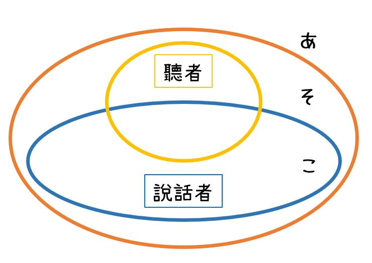

# こそあど系列詞

- こ　表示與說話者相關
- そ　表示與聽者相關或與說話者聽者都相關
- あ　表示的地點/事情/人等距離比 そ　こ　所表示的都遠
- ど　則表示疑問

|名詞|名詞|連體詞|
|--|--|--|
|地點              |      事情         |(總是接名詞)|
|ここ (這兒)        |これ (這/這個)      |この (這個)|
|そこ (那兒)        |それ (那/那個/它)    |その (那個/那/的)|
|あそこ (更遠的 那兒) |あれ (更遠的 那/那個)|あの (更遠的 這個/那/它的)|
|どこ (哪兒)        |どれ (哪個)         |どの (哪個)|

- ここでは　およがないでください。(請不要在`這裡`游泳)
  - ここ (koko) - "here"
  - では (dewa) - particle indicating "at/in" (in this case, "in this place")
  - およがない (oyoganai) - "not swim" (negative potential form indicating "cannot swim")
  - でください (dekudasai) - "please do not" (polite request/command form)
- あそこで　およいでください。(請在`那兒`游泳)
  - あそこ (asoko) - "over there"
  - で (de) - location particle indicating where the action takes place
  - およいで (oyoide) - "swim" (imperative form)
  - ください (kudasai) - "please" (polite imperative form)
- それは　なんですか。 (那是什麼?)
  - それ (sore) - "that"
  - は (wa) - topic marker
  - なん (nan) - "what"
  - です (desu) - copula indicating politeness
  - か (ka) - question particle indicating a question