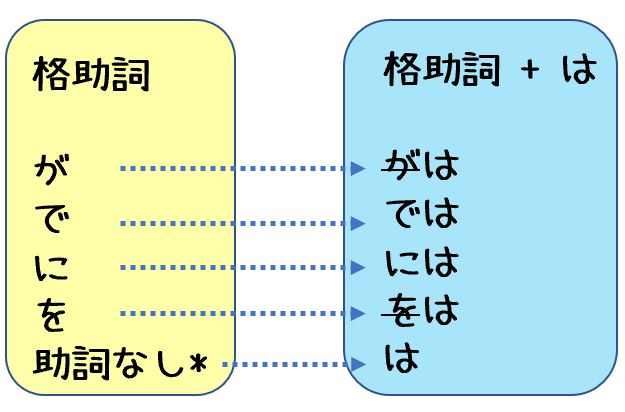

# じょし(助詞)

- 助詞接在名詞、代名詞或著某些副詞和形容詞後**表明這個詞在句中所起到的作用**
- 助詞包含**格助詞**、**副助詞**和**終助詞**

## Particle of topic `は` 與 particle of subject `が` !!?

觀察以下句子 副助詞`は` v.s. 格助詞 `が` `を` `に` `で` `へ`

||1|2|3|4|5|
|--|--|--|--|--|--|
||Mr.田中明天會來|我在那裡買書|我星期一去學校|Isetan現在有sale|我明天會去大板跟京都|
|a|田中さん`は`あした來る|本`は` あそこで 買う|月曜日`には`学校へ行く|いせたん`では` セールを やっている|大阪と京都`へは`あした行く|
|b|田中さん`が`あした來る|あそこで 本`を` 買う|月曜日`に`学校へ行く|いせたん`で` セールを やっている|大阪と京都`へ`あした行く|

- 1.a / 1.b 顯示`は`和`が`使用上的關聯性，但は本身具有普遍性的用法。
- 其他(格)助詞 `が` `を` `に` `で` `へ` 與特定的詞連接使用，用於提示對象、場所、方向、場所...etc
- 而當 `は` 與這些(格)助詞連接使用，則是把這些**用來提示對象、主詞、方向、場所等句子中的部分凸顯為"關鍵的部分"**，將此**做為句子的話題***。 也就是說 `は`起到了聚焦話題的作用
  - E.g. `文全體 = 話題 + 剩餘的部分`
  - 在這樣的用法中 如3/4/5-a所示，`は` 與 `に` `で`　`へ` 共同使用。
  - 你可以把1/2-a理解成: 當 `は` 與 `が`　`を`共同使用時，我們只保留`は`。
  - E.g. 即使加上`は`　"...が"　"...で" 等表達的內容不變。"...~~が~~`は`"依然提示主詞　"...で`は`" 依然提示場所

- 所以 "提示主詞"該用`は`還是`が`是個錯誤命題。
  - `は`本身就是提示主題的副助詞。
  - `が`是提示主題的格助詞，就像`に`是提示方向的格助詞。
  - 格助詞都可與`は`連用，只是`は` 與 `が`　`を`共同使用時，我們只保留`は`。

> :bulb: 重點在於，若想把某一關鍵部分作為話題，就該把那部份加上`は`

- 不論肯定還是否定，也不論用言類型，在提示主詞時都使用`が`，想要將主詞作為話題時，就把`が`再加上`は`，然後省略掉原本的`が`。
- 另外，在疑問句中對某個詞進行否定時，人們會將那個詞是為焦點提示句的主題，也因此否定回答的`は`即為話題的`は`。這與 `に` `で` `へ` + `は`是基本相同的原理!

## 表主題(副助詞) `は`

- は一般放在句子的開頭部分 在一句話中可以多次使用

- おなまえ`は`　(請問你叫啥名子)
  - お (o) - honorific prefix
  - 名前 (na-mae) - name
  - は (wa) - topic particle indicating the subject of the sentence
- ヂャンさん`は`　ちゅうごくじんですが。 (張先生是中國人嗎)
  - 張さん (Zhang-san) - Mr. Zhang (in Japanese name order)
  - は (wa) - topic particle
  - 中国人 (chuugoku-jin) - Chinese person
  - ですが (desu-ga) - conjunction meaning "but," "although," or "however" (polite form)
- あした`は`　はやく　あきようと おもいす。(明天我要早起)
  - あした (a-shi-ta) - tomorrow
  - はやく (ha-ya-ku) - early
  - あきる (a-ki-ru) - wake up (intransitive verb)
  - ～ようとおもいます (yō-to-omoimasu) - think of doing (expression used to indicate one's intention to do something)
- おおさかへ`は`　らいしゅう　いきます。 (我下周去大阪)
  - おおさか (o-o-sa-ka) - Osaka (a city in Japan)
  - へは (he-wa) - to (particle indicating destination)
  - らいしゅう (rai-shuu) - next week
  - いきます (i-ki-masu) - go (polite form of the verb "iku")

## 表否定(副助詞)　`は`

- かいしやへ`は`　いかないんです (我不去公司)
  - 会社 (kai-sha) - office, workplace, company
  - へ (e) - directional particle indicating the destination
  - は (wa) - topic particle
  - 行かない (i-ka-nai) - negative form of the verb "iku" (go)
  - ん (n) - explanatory sentence-ending particle
  - です (desu) - copula (polite form)

## 表"也"(副助詞) `も`

- きょうも　テニスを　するんですか。 (今天也打網球嗎)
  - 今日 (kyou) - today
  - も (mo) - also, too
  - テニス (te-ni-su) - tennis
  - を (o) - object marking particle
  - する (su-ru) - do, play
  - んですか (n desu ka) - equivalent to "isn't it?" in English, used to ask for confirmation or clarification.

- おおさかへも　いきます。((我)也去大阪)
  - おおさか (o-o-sa-ka) - Osaka
  - へ (e) - to (particle indicating direction)
  - も (mo) - also
  - いきます (i-ki-ma-su) - go (present tense of the verb "iku")

## 表移動方向(格助詞)　`へ`

- がっこう`へ`　いくんです (我去學校)
  - 学校 (ga-kkou) - school
  - へ (e) - directional particle indicating the destination
  - 行く (i-ku) - go (dictionary form of the verb "iku")
  - ん (n) - explanatory sentence-ending particle
  - です (desu) - copula (polite form)

## 表目的(格助詞)　`に`

- かいもの`に`　いくんてす (我去買東西)
  - 買い物 (ka-i-mo-no) - shopping
  - に (ni) - directional particle indicating the purpose or destination
  - 行く (i-ku) - go (dictionary form of the verb "iku")
  - ん (n) - explanatory sentence-ending particle
  - です (desu) - copula (polite form)

## 表存在的場所(格助詞) `に`

- おそばは　どこ`に`　あるんですか。(蕎麥麵在哪)
  - おそばは (o-so-ba-wa) - soba (Japanese noodles made from buckwheat flour) (topic marker particle)
  - どこに (do-ko-ni) - where (location marker particle)
  - あるんですか (a-ru-n-desu-ka) - is there? (ある-a-ru: to exist, んです-n-desu: contraction of のです-no-desu, used for emphasis/explanation, か-ka: question particle)
- おおきい　はこの　なか`に`　あります。(在大盒子裡面)
  - おおきい (o-o-ki-i) - big/large
  - はこの (ha-ko-no) - this box (possessive particle)
  - なかに (na-ka-ni) - inside (location marker particle)
  - あります (a-ri-mas-u) - exists/is present (used as a polite form of ある-a-ru: to exist/be present)

## 表狀態的場所(格助詞)　`に`

- めぐろに　すんでいます。(我住在目黑)
  - 目黒に (me-gu-ro-ni) - in Meguro (a neighborhood in Tokyo, Japan)
  - 住んでいます (su-n-de-i-ma-su) - live (present continuous form of the verb "to live" in a polite expression)

## 表行為/動作的時間(格助詞)　`に`

- こんとの　にちようび`に`　どこかへ　いきますか。(這個星期天要出去嗎)
  - こんとの (kon-to-no) - this Sunday
  - にちようびに (ni-chi-yo-u-bi-ni) - on Sunday (day of the week)
  - どこかへ (do-ko-ka-e) - somewhere (destination particle)
  - いきますか (i-ki-ma-su-ka) - are you going? (polite question form of the verb "iku")
- 何時`に`行けばいいですか。(幾點去好呢)
  - 何時に (nan-ji-ni) - at what time
  - 行けば (i-ke-ba) - should go (conditional form of the verb "iku")
  - いいですか (ii-desu-ka) - is it okay?

## 表行為/動作的時間(格助詞)　`で`

- うみ`で`　およごうと　おもいます。(我想在海裡游泳)
  - うみ (umi) - "sea"
  - で (de) - location particle indicating where the action takes place
  - およごう (oyogou) - "swim" (verb in volitional form indicating intent or plan)
  - と (to) - conjunction particle
  - おもいます (omoimasu) - "think" (polite present tense)
- うみ`では`　およがたいでください。(請不要在海裡游泳)
  - うみ (umi) - "sea"
  - では (dewa) - particle indicating "at/in" (in this case, "in the sea")
  - およがたい (oyogatai) - "swim" (negative potential form indicating "cannot swim")
  - でください (dekudasai) - "please do not" (polite request/command form)

## 連接名詞(格助詞)　`の`

- こんど`の`　にちようび (這個/再來的星期天)
  - こんどの (kon-do-no) - next (adjective for time)
  - にちようび (ni-chi-you-bi) - Sunday
- わたし`の`　うち (我的家)
  - わたし (wa-ta-shi) - I, me
  - の (no) - possessive particle
  - うち (u-chi) - house, home

## 他動詞的受詞(格助詞) `を`

- 當加`は`時 `を`省略
  - A: "テニスを　するんですか。" (今天打網球嗎)
  - B: "いいえ、テニス~~を~~は　しません。" (不，我不打)
- 當加`も`時 `を`省略
  - しごとを　します。　べんきょう~~を~~も　します。 (我既工作，也學習)
    - しごと (shi-go-to) - work
    - を (o) - object marker particle
    - します (shi-ma-su) - do, perform (present tense of the verb "suru")
    - べんきょう (ben-kyo-u) - study
    - も (mo) - also, too
    - します (shi-ma-su) - do, perform (present tense of the verb "suru")

## 從(格助詞) `から`

- いま`から`　(從現在)
  - いま (ima) - "now"
  - から (kara) - "from" (indicating the starting point of an action or event)

## 到、截止、直到(格助詞)　`まで`

- よじから　ろくじ`まで`。(從4點到6點)
- ここから　うえの`まで`。(從這裡到上野)

## 方法/手段/媒介(格助詞) `で`

- ぎんざせん`で`　いってください。(請坐銀座線去)
  - 銀座線 (Ginza-sen) - "Ginza Line"
  - で (de) - particle indicating the means of transportation
  - 行ってください (itte kudasai) - "please go" (polite request)
- ペン`では`　かかないでください。(請不要用鉛筆寫)
  - ペン (pen) - "pen" (using the Japanese katakana script)
  - では (de wa) - particle indicating a location where an action takes place
  - 書かないで (kakanaide) - "don't write" (using the negative form of the verb 書く, kaku)
  - ください (kudasai) - "please" (polite request)

## 和(格助詞) `と`

和朋友打網球

- と是用來連接名詞和代名詞的，不能用來連接句子。
- ニュース`と`　てんきよほう (新聞和天氣預報)
  - ニュース (nyuusu) - "news"
  - てんきよほう (tenki yohou) - "weather forecast"
- ともだち`と`　テニスを　やるんです。(和朋友打網球)
  - 友達 (tomodachi) - "friend"
  - と (to) - particle indicating a joint action or state
  - テニス (tenisu) - "tennis" (using the Japanese katakana script)
  - を (wo) - object marker
  - やる (yaru) - "play/do"
  - んです (n desu) - contraction of のです, which adds emphasis or provides explanation.

## ...和...等(格助詞) `や`

- や比と的使用範圍更加廣泛。
- ニュース`と`ドラマ　意思是僅限兩件事物　ニュース　和　ドラマ
- 而　ニュース`や`ドラマ　表示除了這兩件事物之外可能還包括其他。

## 可能行動詞的受詞(格助詞): `が`

- にほんごを　はなす。 (我說日語。)
  - を是動詞的受詞。
- にほんごが　はなせる。(我會說日語。)
  - が是可能態動詞的受詞。

- 當加 は 或 も 時，が省略
  - にほんりょうり~~が~~は　たべられないんです。 (我不能吃日本料理)
  - にほんご~~が~~も　はなせます。 (我也會說日語)

## 動詞/形容詞/名詞+助動詞です句的主詞　(格助詞)　`が`

- かぜ`が`　つよいからです (因為風太大)

  - かぜ (kaze) - "wind"
  - が (ga) - subject marker
  - つよい (tsuyoi) - "strong"
  - から (kara) - "because"
  - です (desu) - copula indicating politeness.

- 當加 `は`時 `が`省略

  - チャンさん~~が~~`は`　ちゅうごくじんですか。(你是中國人嘛)
    - チャンさん (chan-san) - "Mr./Ms. Chang" (Japanese way of addressing someone with the surname Chang)
    - は (wa) - topic marker
    - ちゅうごくじん (Chuugokujin) - "Chinese person" (literally "person from China")
    - です (desu) - copula indicating politeness
    - か (ka) - question particle indicating a question
  - きょう~~が~~`は`　ここのかですか。
- 當加`も`時 `が`省略
  - あした~~が~~も　はらです。
    - English translation: Tomorrow will also be sunny.
    - あした (ashita) - "tomorrow"
    - も (mo) - particle meaning "also"
    - はら (hara) - "sunny"
    - です (desu) - copula indicating politeness.

## 表疑問句句尾(終助詞)　`か`

- どこへ　いくんてっす`か`。(你去哪?)
  - どこ (doko) - where
  - へ (e) - directional particle indicating the destination
  - 行く (i-ku) - to go
  - ん (n) - explanatory sentence-ending particle
  - です (desu) - copula (polite form)
  - か (ka) - sentence-ending particle indicating a question

## 表對聽話人所說內容的確認(終助詞)　(音調降低) `か`

- そうですか。 (我明白了)
- がっこうへ　いくんですか。(音調降低) (我知道你馬上去學校)
- がっこうへ　いくんですか。(音調上升) (你要去學校嗎?)

## 表加強語氣(終助詞)　`よ`

- あしたは　やすみです`よ`。(明天休息。)
  - あした (ashita) - "tomorrow"
  - は (wa) - topic marker
  - やすみ (yasumi) - "day off"
  - です (desu) - copula indicating politeness
  - よ (yo) - sentence-ending particle used for emphasis or assertion.

## 徵求對方同意 (終助詞) `ね`

- よかったですね。(你真是太幸運了 難道不是嗎?)
  - よかった (yokatta) - "that's great" (expression of relief or satisfaction)
  - です (desu) - copula indicating politeness
  - ね (ne) - sentence-ending particle used to seek agreement or confirmation from the listener.